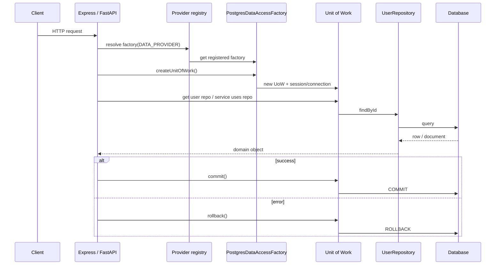

# Centralized data layer — strategy and Jira-ready backlog

If you are new to these patterns, read the sections in order: [Getting started](#getting-started) → [Glossary](#glossary) → [The three patterns in plain language](#the-three-patterns-in-plain-language) → [How this works for multiple projects](#how-this-works-for-multiple-projects), then use the [Jira backlog](#epic-1--foundations-and-packaging) as your work board.

It explains how a **single data-access design** is rolled out across **many services** while supporting **two runtimes** (Node.js / TypeScript and Python / FastAPI), and it lists **Jira-ready** epics, stories, and tasks.

The approach follows a common **abstract factory** model: a small set of **interfaces** (the factory, unit of work, repositories) and a **string or config key** (e.g. `DATA_PROVIDER=postgres`) that selects which **concrete factory** to use. Each database or driver stack has its own factory implementation. In this initiative we name these pieces **Repository**, **Unit of Work**, and **Data Access Factory**. The **swap point** is always the same: **one factory per database or driver stack**, selected by **configuration** so the rest of the app does not hard-code a specific database.

---

## Getting started

### What problem are we solving?

Today, different projects might talk to PostgreSQL, MongoDB, or another store by sprinkling **SQL, ORM calls, or driver code** inside HTTP handlers and services. That works for a while, but when the business asks to **change the database** or run the same logic in **Node and Python**, you end up with:

- Large refactors and risky find-and-replace;
- The same business rules reimplemented slightly differently;
- Hard-to-test code because everything is tied to a real database connection.

We want **one clear place** for “how we talk to data,” with **interfaces** in the middle so that:

- **Application code** (Express routes, FastAPI routes, domain services) depends on **interfaces** (e.g. `IUserRepository`), not on “Postgres” or “Mongo” by name;
- **Swapping the database** means adding or switching a **provider package** and **config**, not rewriting every service.

### What you will actually build (high level)

1. **Core packages (no real database inside):** TypeScript and Python libraries that define **interfaces only** — what a repository and unit of work must do, and how to obtain them from a factory.
2. **Provider packages (real database here):** Separate packages like `data-layer-postgres-ts` that **implement** those interfaces using Drizzle, Prisma, `pg`, SQLAlchemy, etc.
3. **Each API service:** On startup, reads `DATA_PROVIDER=postgres` (or similar), **registers** the right factory, and for each request creates a **Unit of Work**, uses **repositories** from it, then **commits** or **rollbacks** on success or error.

A typical rollout starts with **Story 1.1 / 1.2** (core contracts), then a **reference provider** (Postgres) to validate end-to-end wiring before adding more databases.

### How to use this document with Jira

- **Epic** = big theme (e.g. “Foundations”).
- **Story** = a deliverable a stakeholder cares about, with **acceptance criteria** (checklist).
- **Task / Sub-task** = concrete work items; assign owners and story points in Jira, not in this file.

---

## Glossary

| Term | Short meaning |
|------|----------------|
| **Repository** | An object that loads and saves **one kind of business thing** (e.g. users, books) **through an interface**, hiding whether the data lives in SQL, Mongo, or a file. |
| **Unit of Work (UoW)** | A single **transaction scope**: one place to **commit** or **rollback** so that several repository operations succeed or fail **together**. |
| **Factory (data access factory)** | Something that **creates** a Unit of Work (and indirectly the repositories wired to the same connection/session). Different factories exist for Postgres vs Mongo. |
| **Provider** | **Which database stack** we use — often configured as a string like `postgres` or `mongodb`. |
| **Provider registry** | A small map from **provider string** → **concrete factory class** (often populated at application startup). |
| **Composition root** | The **one place** in the app (startup, DI container) where we choose the real Postgres factory vs Mongo factory. Handlers should not `new` database clients themselves. |
| **Aggregate** | A cluster of domain objects you treat as **one unit** for loading/saving (e.g. `Order` + `OrderLine`). Often one repository per aggregate root. |
| **DAO (Data Access Object)** | Older name for “the thing that talks to the database.” We prefer **Repository** but the idea overlaps. |
| **DTO** | Data shaped for **APIs** (JSON). Not the same as **persistence models** (tables/documents). Mapping between them usually stays in the API or application layer. |

---

## The three patterns in plain language

### 1. Repository pattern

**Without the pattern:** Your route handler runs raw SQL or calls `db.collection.find()` directly.

**With the pattern:** Your handler (or a domain service) calls `userRepository.findById(id)`. The **interface** `IUserRepository` is defined in a shared place. **Postgres** and **Mongo** each provide a **different class** that implements the same interface.

**Why it helps:** If you change databases, you rewrite **one class per repository**, not every route.

**Tip:** Start with **one** aggregate (e.g. `User`). Define `IUserRepository` with the methods the **application** truly needs (avoid exposing every possible SQL query). Add methods only when a feature needs them.

---

### 2. Unit of Work pattern

**Without the pattern:** You open a transaction in one function, pass `client` everywhere, and forget to commit — or you commit half the work by mistake.

**With the pattern:** You create **one** `UnitOfWork` per request (or per background job). All repositories used in that request share the **same** transaction. At the end you call **either** `commit()` **or** `rollback()` once.

**Why it helps:** **Atomicity** — either all related writes succeed, or none do. Easier to reason about than scattered `BEGIN`/`COMMIT`.

**Tip:** In FastAPI, a `yield` dependency is a common way to create UoW at the start of the request and `commit`/`rollback`/`close` after the handler. In Express, similar behavior can be done with middleware or a **request-scoped** container. Follow your team’s example once Story 4.1 / 4.2 is implemented.

**Concrete UoW:** In real code, `PostgresUnitOfWork` might expose properties like `users` and `books` that return `IUserRepository` / `IBookRepository` tied to the **same** SQL transaction.

---

### 3. Factory pattern (abstract factory)

**Without the pattern:** `if (env.DB_TYPE === 'mongo')` appears in ten files.

**With the pattern:** At startup you **register** `postgres` → `PostgresDataAccessFactory`. Application code only knows `IDataAccessFactory` and calls `createUnitOfWork()`. The factory returns a UoW wired for Postgres **or** Mongo, depending on configuration.

**Why it helps:** **One switch** in configuration and composition root, not many switches across the codebase.

In classical abstract-factory examples, a resolver switches on a string and returns an object that exposes several related DAOs or repositories. Here, **`IDataAccessFactory`** focuses on creating a **Unit of Work**; repositories are typically accessed **through** that UoW.

---

## Diagram: one HTTP request (conceptual)



You do not need to memorize this diagram. Use it to see **who creates what** and **when commit runs**.

---

## How this works for multiple projects

### 1. Shared design, two language packages

- **Contracts (language-specific):** TypeScript **interfaces** and Python **Protocols / ABCs** define `IUnitOfWork`, `IRepository<…>`, and `IDataAccessFactory`. These live in two small packages published internally (for example npm and a private PyPI): often named like `data-layer-ts` and `data-layer-py`.
- **Why two packages:** Node and Python cannot share binary code. They **share the idea** (names, responsibilities, and boundaries), not the same `.dll` or `.so` file.
- **Provider packages:** Each database + ORM combination gets its **own** package, for example:
  - `data-layer-postgres-ts` (implements factories and repos for Node),
  - `data-layer-postgres-py` (implements for FastAPI),
  - later `data-layer-mongo-ts`, etc.
- **Composition root:** Each Express or FastAPI app reads config (`DATA_PROVIDER=postgres`, connection URL). It does **not** import low-level driver code in every file. It uses the **registry** to resolve the correct factory from that key, then calls `createUnitOfWork()` once per request or transaction scope.

### 2. Repository pattern (reminder)

- **Services and handlers** depend on **repository interfaces** such as `IUserRepository`, not on raw SQL or Mongo queries.
- **Concrete** classes like `PostgresUserRepository` and `MongoUserRepository` implement the **same** interface; only one is active at runtime, chosen by the factory/provider.

### 3. Unit of Work (reminder)

- One UoW instance = **one transactional boundary** for that request (or job).
- Repositories created under that UoW share the **same** connection or session so `commit` / `rollback` applies to **all** of them together.

### 4. Factory pattern (reminder)

- **`IDataAccessFactory`:** “Give me a new Unit of Work.”
- **`PostgresDataAccessFactory` / `MongoDataAccessFactory`:** Know how to build a UoW for that stack.
- **Registry:** Maps string keys (`postgres`, `mongodb`) to the right factory class. Adding a new database means **new provider package** + **register** it once — not editing every service.

### 5. Keeping Node and Python aligned

- Use the **same vocabulary** (`UnitOfWork`, `DataAccessFactory`, `ProviderRegistry`) and the **same layering rules** so developers can move between codebases.
- **DTOs** for HTTP can diverge slightly by framework; **repository interfaces** and **transaction rules** should stay parallel where possible.

### 6. What actually changes when we “swap databases”

- **Changes:** New provider package, configuration (`DATA_PROVIDER`), connection strings, migrations for that store, integration tests for that provider.
- **Should not need mass changes:** Route handlers and domain services that only use **interfaces**.

---

## Layering: where code lives

Think of three rings:

1. **API layer (Express / FastAPI):** HTTP concerns, validation, status codes. Calls **application services** or **repositories** but does not embed SQL.
2. **Application / domain layer:** Use cases (“register user,” “borrow book”). Depends on **repository interfaces** and `IUnitOfWork`.
3. **Infrastructure / provider layer:** Implements repositories with **real** Postgres, Mongo, etc. Referenced only from the **composition root** and provider packages.

**Common pitfall:** Importing `pg` or `sqlalchemy` inside a route file “just for this one query.” That bypasses the factory and makes swapping databases expensive.

---

## Epic 1 — Foundations and packaging

**Goal:** Establish the **contracts** first. There should be **zero** imports of `pg`, `mongodb`, `sqlalchemy`, etc. in the core packages.

### Story 1.1 — Define core abstractions (TypeScript)

**User story:** As a backend developer, I want shared TypeScript interfaces for Unit of Work, Repository, and Data Access Factory so that all Express services can depend on stable contracts.

**Why it matters:** Every Express service can import the same types. Teams agree on **what** a repository must do without locking in Postgres.

**Acceptance criteria:**

- [ ] `IUnitOfWork` includes `commit` and `rollback` (async `Promise` is fine).
- [ ] Document that **concrete** UoWs will expose domain repositories (e.g. `readonly users: IUserRepository`) — the base interface might stay small on purpose.
- [ ] `IDataAccessFactory` exposes `createUnitOfWork(): IUnitOfWork`.
- [ ] A **provider registry** type maps a string key to `IDataAccessFactory` (include an in-memory implementation for tests).
- [ ] `tsc` passes; **no** database driver in the core package.

**Learning outcomes:** You can explain what each interface is for and why handlers must not import drivers.

**Tasks (detailed):**

1. Create `typescript/` package layout and `package.json` (align scope name with your company, e.g. `@company/data-layer`).
2. Add `src/abstractions/*.ts` and a barrel `src/index.ts` that re-exports public types.
3. Write a short **developer note** in code comments or internal wiki: how Express apps should obtain `IDataAccessFactory` once at startup.
4. Add CI: `npm run type-check` (install in CI is OK even if local policy restricts installs — clarify with lead).

**Common mistakes:**

- Putting Drizzle/Prisma models inside the core package — **keep them in the Postgres provider package**.
- Making `IRepository` too large (dozens of methods). Prefer **focused** interfaces per aggregate.

**Definition of done:** Another developer can import the package and implement a **fake** factory for tests without touching a database.

---

### Story 1.2 — Define core abstractions (Python)

**User story:** As a backend developer, I want Protocols/ABCs for Unit of Work, Repository, and Data Access Factory so FastAPI services share the same rules as Node.

**Why it matters:** Python services get the **same mental model** as TypeScript services.

**Acceptance criteria:**

- [ ] `IUnitOfWork` has async `commit` / `rollback`.
- [ ] Repository pattern documented: domain-specific Protocols will live next to domain code or a shared contract module; **core** only shows the generic shape if needed.
- [ ] `IDataAccessFactory` has async `create_unit_of_work()` (matches async session lifecycle).
- [ ] Provider registry mirrors TypeScript behavior.
- [ ] No SQLAlchemy/Motor/PyMongo in the core package.

**Learning outcomes:** You understand **Protocol** vs **ABC** and when async factory methods are appropriate.

**Tasks (detailed):**

1. `python/` with `pyproject.toml` and package `data_layer` (rename per company policy).
2. Implement `abstractions/` and export from `__init__.py`.
3. Document a **FastAPI** pattern: `Depends()` yields UoW, `try/finally` or exception handlers call rollback — link to Story 4.2 when ready.

**Common mistakes:**

- Mixing FastAPI `Session` imports into the core package.
- Forgetting to **await** `commit`/`rollback` in async code.

**Definition of done:** A colleague can write a **stub** `IDataAccessFactory` that returns an in-memory UoW for unit tests.

---

### Story 1.3 — Internal publishing and versioning

**User story:** As platform engineering, I want both packages versioned and published so services pin compatible releases.

**Acceptance criteria:**

- [ ] Semantic versioning documented (when is it MAJOR vs MINOR for interface changes).
- [ ] Changelog or release notes for breaking changes to public interfaces.

**Tasks:**

1. Align names with internal npm and PyPI conventions.
2. Release checklist: tag, changelog entry, notify consumers in Slack/email.

**Release discipline:** Changelog entries should accompany completed stories; coordinate before any **MAJOR** version bump that breaks public interfaces.

---

## Epic 2 — Provider plug-ins (swap databases)

**Goal:** Prove **end-to-end** wiring: one real database, full path from factory → UoW → repository → DB.

### Story 2.1 — Reference PostgreSQL provider (TypeScript)

**User story:** As a team, we want one full reference implementation (Postgres + chosen ORM or driver) to prove the factory and UoW wiring.

**Acceptance criteria:**

- [ ] `PostgresDataAccessFactory` implements `IDataAccessFactory`.
- [ ] `PostgresUnitOfWork` implements `IUnitOfWork` and exposes at least one sample repository implementation (e.g. `User`).
- [ ] `commit`/`rollback` map to the driver’s transaction semantics.

**Tasks:**

1. **Spike:** Pick ORM/query layer (Drizzle, Prisma, raw `pg`) — document **pros/cons** in one page (team decision).
2. Implement one **migration** strategy (where migrations live, how CI applies them).
3. Integration test: optional Testcontainers or shared dev DB (follow company policy).

**Learning outcomes:** You can trace a **single** `INSERT` from handler to SQL and see **where** the transaction commits.

**Hints:** Keep connection pooling in the factory or a dedicated module; do not create a new pool per request unless documented.

---

### Story 2.2 — Reference PostgreSQL provider (Python)

**User story:** Same as 2.1 for FastAPI (SQLAlchemy 2 async or equivalent).

**Acceptance criteria:**

- [ ] Async session is owned by the UoW; repositories receive session via constructor or property.
- [ ] Transaction behavior matches the TypeScript reference as closely as practical.

**Tasks:**

1. Choose stack (e.g. SQLAlchemy 2 + asyncpg) and document.
2. Implement the **same** sample aggregate as 2.1 so reviewers can compare stacks side by side.

---

### Story 2.3 — Second provider (e.g. MongoDB) as swap proof

**User story:** As an architect, I want a second provider to prove application code does not depend on the first database.

**Acceptance criteria:**

- [ ] Second factory implementation for at least one runtime (both is ideal).
- [ ] Same `IUserRepository` (or chosen interface); **different** concrete classes.
- [ ] Demo or test: run the same service tests with **config flip** where feasible.

**Note:** On the second provider, implement **one** repository method at a time if helpful — **matching the interface** exactly is the priority.

---

## Epic 3 — Cross-cutting concerns

### Story 3.1 — Configuration and secrets

**User story:** Standardize environment variables (`DATA_PROVIDER`, URLs, pool sizes).

**Tasks:** Document all vars in one table; use vault/Kubernetes secrets in prod; **never** commit `.env` with real passwords.

**Tip:** Use `.env.example` with **dummy** values only.

---

### Story 3.2 — Observability

**User story:** Operators can see failed commits and slow transactions.

**Tasks:** Optional OpenTelemetry spans (`unit_of_work.commit`, provider name tag); log correlation IDs on errors.

---

### Story 3.3 — Testing strategy

**User story:** Developers know how to unit test without Postgres and how to run integration tests with it.

**Tasks:**

- **Unit tests:** Fake `IDataAccessFactory` / in-memory UoW.
- **Integration tests:** Real provider against disposable DB (policy-dependent).
- **Contract tests:** Optional — ensure each provider’s factory implements the same behaviors.

**Tip:** Use **Arrange–Act–Assert** structure and test **rollback** on forced failures.

---

## Epic 4 — Adoption in Express and FastAPI

### Story 4.1 — Express middleware / DI example

**User story:** Document one blessed pattern: request-scoped UoW; **rollback** on uncaught errors.

**Tasks:** Example repo with middleware, error handler that rolls back, and a sample route using **only** repository interfaces.

**Review focus:** Trace the request lifecycle and list **every** line where UoW is created and disposed.

---

### Story 4.2 — FastAPI dependency example

**User story:** Same as 4.1 using FastAPI `Depends` + `yield`.

**Tasks:** Example router, exception handling, and async `commit`/`rollback`.

---

### Story 4.3 — Migration playbook for existing services

**User story:** Teams can move legacy “SQL in handler” code into repositories step by step.

**Tasks:** Pilot one small Express service and one small FastAPI service; measure lines removed from handlers; document pitfalls.

**Suggested migration steps:**

1. Identify direct DB usage in a route.
2. Introduce `IUserRepository` and move **one** query into `PostgresUserRepository`.
3. Inject repository via factory/UoW; route calls interface only.
4. Repeat per endpoint; add tests as you go.

---

## Suggested Jira structure

| Jira item | Type | Suggested summary |
|-----------|------|-------------------|
| Centralized data layer | Epic | E1 Foundations |
| Provider plug-ins | Epic | E2 Providers |
| Cross-cutting | Epic | E3 Platform |
| Adoption | Epic | E4 Rollout |

Create **Stories** from the sections above; copy **Tasks** as **Sub-tasks**. Use labels such as: `data-layer`, `typescript`, `python`, `express`, `fastapi`, `architecture`.

---

## FAQ

**Q: Why not use only an ORM and skip repositories?**  
A: An ORM helps with SQL, but **repository interfaces** stabilize **your** app’s needs. You can swap ORMs or databases behind the same interface.

**Q: Where do I put “complex queries”?**  
A: Inside the **concrete** repository for that database, or a small query object used by that repository — not in the HTTP handler.

**Q: Is Unit of Work always one per HTTP request?**  
A: Often **yes** for web APIs. Background jobs might use one UoW per **message** or per **batch** — team rules apply.

**Q: Can two services share one repository package?**  
A: **Interfaces and domain** can be shared. **Provider** packages are shared too. Each **service** still has its own connection config and process.

---

## Out of scope (for later)

- HTTP API concerns (REST handlers, request/response DTOs, validation) stay in API projects—not in the shared data layer.
- **Distributed** transactions across two different databases (use sagas, outbox, or other patterns — not this epic).
- Caching inside the base repository (optional future epic).
- Choosing **one** global ORM for all languages (TypeScript and Python will each have their own stack; alignment is at the **contract** level).

---

## Appendix: folder layout in this repo (reference)

```
Data layer/
  JIRA-DATA-LAYER-BACKLOG.md    ← this document
  typescript/                   ← core contracts (npm package)
  python/                         ← core contracts (Python package)
```

Provider packages (Postgres, Mongo, …) will be **additional** folders or separate repositories as your team decides.
