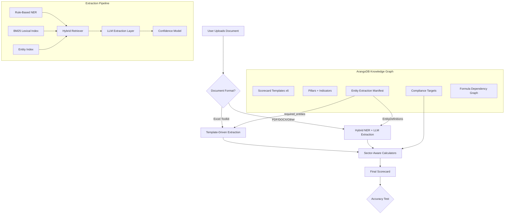

# Okiru B-BBEE System -- Development Progress

**Last Updated:** 2026-03-21  
**Status:** Phase 1-8 Implementation Complete (Production VM: https://20.164.207.196)

---

## System Architecture

```
okiru-pro-main/
├── apps/
│   ├── api/                         # Main API (Express + TypeScript)
│   │   ├── pipeline/                # B-BBEE data extraction pipeline
│   │   │   ├── excelParser.ts       # Excel sheet parser (12 sheet types)
│   │   │   ├── entityExtractor.ts   # NER entity extraction
│   │   │   ├── formulaGraphBuilder.ts  # Formula dependency graph builder
│   │   │   ├── calculators.ts       # Legacy scorecard calculations (RCOGP-only)
│   │   │   ├── sectorConfig.ts      # Sector-specific configurations (6 sectors)
│   │   │   ├── sectorCalculators.ts # Parameterized sector-aware calculators
│   │   │   ├── buildResult.ts       # Pipeline result assembler (now sector-aware)
│   │   │   ├── levelDetermination.ts# BEE level determination
│   │   │   ├── textSimilarity.ts    # Fuzzy matching (BM25 + Levenshtein)
│   │   │   ├── industryNorms.ts     # Industry norm lookup
│   │   │   ├── suggestions.ts       # Strategy pack suggestions
│   │   │   ├── types.ts             # Pipeline result types
│   │   │   └── extraction/          # Full extraction pipeline
│   │   │       ├── nerEngine.ts         # Rule-based NER (ported from audit-ai)
│   │   │       ├── bm25Index.ts         # BM25 lexical search index
│   │   │       ├── entityIndex.ts       # B-BBEE entity config index
│   │   │       ├── hybridRetriever.ts   # Multi-signal hybrid retrieval
│   │   │       ├── llmExtractor.ts      # LLM extraction with anti-hallucination
│   │   │       ├── documentChunker.ts   # Hierarchical document chunking
│   │   │       ├── confidenceScorer.ts  # 10-point confidence model
│   │   │       ├── entityManifest.ts    # Entity Extraction Manifest builder
│   │   │       ├── validator.ts         # Cross-reference validation
│   │   │       └── provenanceTracker.ts # Full audit trail
│   │   ├── arango/                  # ArangoDB integration layer
│   │   │   ├── connection.ts        # Connection manager
│   │   │   ├── collections.ts       # Collection definitions (incl. entity_manifests)
│   │   │   ├── repositories/        # Graph-aware repositories
│   │   │   │   ├── scorecardRepository.ts
│   │   │   │   ├── assessmentRepository.ts
│   │   │   │   └── graphRepository.ts
│   │   │   ├── queries/             # AQL graph traversal queries
│   │   │   │   └── graphTraversal.ts
│   │   │   └── ingestion/           # Toolkit template ingestion
│   │   │       └── templateIngester.ts  # Sector-specific pillar defs (6 types)
│   │   ├── src/routes/accuracy.ts   # Accuracy testing API
│   │   ├── __tests__/accuracy/      # Accuracy test framework
│   │   │   ├── accuracyTestRunner.ts    # Per-file and batch test runner
│   │   │   └── arangoCalcPathTest.ts    # ArangoDB vs in-code config comparison
│   │   ├── db.ts                    # MongoDB connection
│   │   ├── storage.ts              # MongoDB storage layer
│   │   └── models.ts               # Mongoose models
│   ├── Computation-Engine/          # Python FastAPI + ArangoDB
│   └── web/
│       └── Toolkit/src/pages/
│           ├── ExcelImport.tsx      # Excel upload & processing
│           ├── AccuracyReport.tsx   # Accuracy comparison UI
│           ├── ProvenanceGraph.tsx  # Interactive formula graph visualization
│           └── ...
└── docs/
    └── BBBEE_SYSTEM_PROGRESS.md     # This file
```

---

## Architecture Diagram



---

## Phase Completion Status

### Phase 1: Formula Extraction -- COMPLETE
- Created `formulaGraphBuilder.ts` that extracts Excel formulas with `cellFormula: true`
- Builds directed acyclic graphs (DAGs) from cell references
- Parses cell address ranges (e.g. `A1:C3`) into individual dependencies
- Semantic tagging system identifies B-BBEE pillar, indicator, and role for each cell
- Scorecard subgraph extraction filters to only B-BBEE-relevant cells
- Topological sort (Kahn's algorithm) for evaluation ordering
- Cycle detection for graph integrity validation

### Phase 2: ArangoDB Integration Layer -- COMPLETE
- Added `arangojs` to API dependencies
- Connection manager with auto-database creation
- 12 document collections + 7 edge collections + `entity_manifests` collection
- `ScorecardRepository`: CRUD for scorecards, pillars, indicators, compliance targets
- `AssessmentRepository`: Client assessments, cell values, calculation results, audit trail
- `GraphRepository`: Formula graph storage, dependency traversal, what-if analysis
- AQL query builders for provenance tracing and cross-pillar dependency detection
- Dual-database architecture: MongoDB (users/auth) + ArangoDB (B-BBEE domain)

### Phase 3: Toolkit Template Ingestion -- COMPLETE
- **6 sector-specific pillar definitions** (RCOGP Generic, ICT Generic, FSC Generic, Agri Generic, RCOGP QSE, ICT QSE)
- Ingestion service that parses toolkit templates into ArangoDB graph
- Sector-specific pillar defs lookup map (`SECTOR_PILLAR_DEFS`)
- `ingestAllToolkits()` now passes correct pillar definitions per sector
- Formula graph extraction and storage during ingestion
- API route `/api/accuracy/ingest` for triggering ingestion

### Phase 4: Accuracy Testing Framework -- COMPLETE
- `accuracyTestRunner.ts`: CLI tool for single-file and batch accuracy testing
- **Now sector-aware**: uses `detectSectorFromName()` for per-sector max points
- Per-pillar deviation reporting with 0.5-point tolerance threshold
- Formatted text reports with full extraction statistics
- Batch runner covers all 6 toolkit templates + Lake Trading test case
- `arangoCalcPathTest.ts`: ArangoDB vs in-code config comparison with synthetic data
- API route `/api/accuracy/compare` for REST-based comparison

### Phase 5: Entity Extraction Hardening -- COMPLETE
- `confidenceScorer.ts`: **10-point scale confidence model** with 5 factors:
  - Retrieval score (0-4 pts), Entity alignment (0-1.5 pts)
  - Structural verification (0-3.5 pts), Section match (0-0.5 pts)
  - Dual-extraction agreement (0-0.5 pts)
  - Threshold: 9.5/10 for 95% confidence
- `validator.ts`: Cross-reference validation (ownership sums, financial ranges, BEE levels)
- `provenanceTracker.ts`: Full audit trail from Excel cell to extracted value
- Auto-fix for common issues (percentage format conversion, BEE level rounding)

### Phase 6: Frontend Integration -- COMPLETE
- `AccuracyReport.tsx`: Drag-and-drop Excel upload with pillar comparison
- `ProvenanceGraph.tsx`: Interactive formula dependency graph visualization
- Side-by-side pillar comparison with visual progress bars
- Route registered at `/accuracy` in Toolkit app

### Phase 7: Production Backend Overhaul -- COMPLETE (2026-03-19)

#### 7a: Sector-Aware Calculator Wiring
- **`buildResult.ts`** now imports and uses `sectorCalculators.ts` instead of hardcoded `calculators.ts`
- Sector detection via `detectSectorFromName()` from client's industry sector
- All pillar max points, sub-minimum thresholds, and calculation targets come from `SectorConfig`
- MC+EE combined detection uses sector-specific max points (not hardcoded 8/11)
- Scorecard overrides use sector-specific max points

#### 7b: Complete Sector Configurations
- **6 sector configs** in `sectorConfig.ts`: RCOGP Generic, ICT Generic, FSC Generic, AGRI Generic, RCOGP QSE, ICT QSE
- Each config defines: pillar max points, sub-minimum rules, ownership targets, MC/EE/Skills/Procurement/ESD/SED targets, level thresholds
- **6 pillar definition arrays** in `templateIngester.ts` with sector-specific indicator-level weightings

#### 7c: Entity Extraction Manifest
- New `entity_manifests` collection in ArangoDB with indexed `sectorCode` + `scorecardType`
- 32 required entities across 7 pillars with aliases, retrieval hints, validation rules
- 8 sheet hints mapping Excel tab names to pillar codes
- `buildManifestForSector()` generates manifests for all 6 scorecard types
- Bridges "what the scorecard needs" with "what the extractor looks for"

#### 7d: Extraction Pipeline (Ported from audit-ai)
Seven new TypeScript modules in `apps/api/pipeline/extraction/`:

| Module | Purpose | Source |
|--------|---------|--------|
| `nerEngine.ts` | Rule-based NER: MONEY, PERCENT, DATE, FISCAL_YEAR, BEE_LEVEL, RACE_GROUP, GENDER, DESIGNATION, ORG patterns | `audit-ai/pipeline/nlp/ner.py` + `page_ner.py` |
| `bm25Index.ts` | BM25Okapi lexical search with stopword removal | `audit-ai/pipeline/indexing/bm25_index.py` |
| `entityIndex.ts` | B-BBEE entity config index (12 entity types with patterns and boost weights) | `audit-ai/pipeline/indexing/entity_config.py` |
| `hybridRetriever.ts` | Weighted fusion: entity (0.15) + BM25 (0.35) + semantic (0.50) | `audit-ai/pipeline/retrieval/hybrid_retriever.py` |
| `llmExtractor.ts` | GPT-4o-mini extraction with anti-hallucination controls | `audit-ai/pipeline/extraction/context_extractor.py` |
| `documentChunker.ts` | Hierarchical chunking with section detection and TOC context | `audit-ai/pipeline/chunking/hierarchical_chunker.py` |
| `confidenceScorer.ts` | Enhanced 10-point confidence model (5 factors, 95% threshold) | `audit-ai/pipeline/validation/confidence_model.py` |

#### 7e: LLM Anti-Hallucination Strategy
Six controls to achieve 95%+ extraction confidence:
1. **Structural verification**: Extracted value MUST appear in source text (confidence drops to 0.20 if not)
2. **JSON schema enforcement**: `response_format: { type: "json_object" }` forces structured output
3. **Temperature 0**: Deterministic generation
4. **Explicit null instruction**: "If not found, return null" -- better to say "I don't know" than hallucinate
5. **Cross-reference validation**: Ownership sums to 100%, BEE levels 1-8, positive revenue
6. **Dual extraction**: Rule-based first, then LLM; agreement = 0.95 confidence, disagreement flags for review

#### 7f: Root Gitignore
- Added `.gitignore` at repo root excluding `node_modules/`, `dist/`, `.env*`, `*.log`, `.DS_Store`, `*.tsbuildinfo`

---

## B-BBEE Domain Model Reference

### Supported Sectors

| # | Sector | Code | Type | Max Total Points |
|---|--------|------|------|-----------------|
| 1 | RCOGP Generic | RCOGP | Generic | 116 |
| 2 | ICT Generic | ICT | Generic | 118 |
| 3 | FSC Generic | FSC | Generic | 110 |
| 4 | Agri Generic | AGRI | Generic | 116 |
| 5 | RCOGP QSE | RCOGP | QSE | 105 |
| 6 | ICT QSE | ICT | QSE | 105 |

### Scorecard Structure (RCOGP Generic)

| # | Pillar | Max Points | Sub-Minimum |
|---|--------|-----------|-------------|
| 1 | Ownership | 25 | 40% of Net Value |
| 2 | Management Control | 8 | None |
| 3 | Employment Equity | 11 | None |
| 4 | Skills Development | 25 | 40% of spend |
| 5 | Preferential Procurement | 27 | 40% of target |
| 6 | Enterprise & Supplier Dev | 15 | None |
| 7 | Socio-Economic Development | 5 | None |
| - | **Total** | **116** | - |

### Level Determination

| Level | Min Points | Recognition |
|-------|-----------|-------------|
| 1 | 100 | 135% |
| 2 | 95 | 125% |
| 3 | 90 | 110% |
| 4 | 80 | 100% |
| 5 | 75 | 80% |
| 6 | 70 | 60% |
| 7 | 55 | 50% |
| 8 | 40 | 10% |
| NC | <40 | 0% |

### Key Cross-Pillar Dependencies
- NPAT feeds into ESD targets (2% of NPAT) and SED targets (1% of NPAT)
- Leviable amount feeds into Skills Development targets (3.5%)
- TMPS feeds into Preferential Procurement targets (80%)
- Ownership affects procurement recognition levels
- Sub-minimum failures in Ownership, Skills, or Procurement trigger level discounting

---

## How to Run

### Accuracy Test (Single File)
```bash
cd apps/api
npx tsx __tests__/accuracy/accuracyTestRunner.ts "path/to/toolkit.xlsx"
```

### Batch Test (All Toolkits)
```bash
cd apps/api
npx tsx __tests__/accuracy/accuracyTestRunner.ts "C:/path/to/BBBEE Toolkit"
```

### ArangoDB Calculation Path Test
```bash
cd apps/api
npx tsx __tests__/accuracy/arangoCalcPathTest.ts
```

### Start ArangoDB (via Docker)
```bash
cd apps/Computation-Engine
docker compose up -d
```

### API Server
```bash
cd apps/api
npm run dev
```

---

## Latest Accuracy Results (2026-03-19)

### Lake Trading Toolkit (RCOGP) -- PASSED

Accuracy test against `Lake Trading Toolkit (RCOGP).xlsx` (23.5MB, 52 sheets):

| Pillar | Calculated | Toolkit Ref | Deviation | Status |
|--------|-----------|-------------|-----------|--------|
| Ownership | 25.00 | 25.00 | 0.000 | PASS |
| Management Control | 1.18 | 1.18 | 0.000 | PASS |
| Employment Equity | 10.59 | 10.59 | 0.000 | PASS |
| Skills Development | 0.00 | 0.00 | 0.000 | PASS |
| Preferential Procurement | 20.33 | 20.33 | 0.004 | PASS |
| Enterprise & Supplier Dev | 3.69 | 3.69 | 0.001 | PASS |
| Socio-Economic Development | 0.41 | 0.41 | 0.004 | PASS |
| **Total** | **61.20** | - | - | **LEVEL 8** |

Extraction: 1 shareholder, 12 employees, 46 suppliers, 2 ESD, 1 SED contributions.
Graph: 20,489 cells, 11,084 formulas, 28,947 edges.
Timing: Parse 104s, Pipeline 19ms, Graph 52s, Total 156s.

### Key Fixes Applied in Phase 7
- Sector-aware calculators replace hardcoded RCOGP-only calculations
- MC/EE combined element split (toolkit stores as one row, system separates)
- Client name extraction tightened (no longer picks up B-BBEE indicator labels)
- Sector extraction rejects pure numeric values
- Sub-minimum thresholds now use sector-specific percentages
- Accuracy test runner uses detected sector for pillar max points

---

## Extraction Pipeline Architecture

### For Excel Toolkits (Template-Driven)
1. `excelParser.ts` parses sheets using Entity Extraction Manifest's `SheetHints`
2. Pattern matching extracts shareholders, employees, suppliers, trainings, ESD/SED
3. `buildResult.ts` applies sector-aware calculators from `sectorCalculators.ts`
4. Results compared against toolkit's embedded scorecard values

### For Unstructured Documents (Hybrid NER + LLM)
1. **Document Chunking** (`documentChunker.ts`): Hierarchical chunking with section detection
2. **NER Extraction** (`nerEngine.ts`): Rule-based pattern matching for MONEY, DATE, PERCENT, BEE_LEVEL, etc.
3. **Indexing**: BM25 lexical index + Entity index built from document chunks
4. **Hybrid Retrieval** (`hybridRetriever.ts`): Weighted fusion of entity (15%) + BM25 (35%) + semantic (50%)
5. **LLM Extraction** (`llmExtractor.ts`): GPT-4o-mini with anti-hallucination controls
6. **Confidence Scoring** (`confidenceScorer.ts`): 10-point scale, 95% threshold (9.5/10)
7. **Validation** (`validator.ts`): Cross-reference checks (ownership sums, financial ranges)

### Entity Extraction Manifest
Stored in ArangoDB per scorecard template. Each manifest defines:
- **32 required entities** across 7 pillars with aliases, zones, and retrieval hints
- **8 sheet hints** mapping Excel tab names to pillar codes
- **Validation rules** per entity (min/max ranges, required flags)
- **Positive/negative examples** for LLM context

---

## Phase 8: Full Frontend + Pipeline Integration (2026-03-21)

### 6 Sector Toolkit Templates
Added to `apps/web/src/data/starterTemplates.ts` (okiru-pro-main) and `src/data/starterTemplates.ts` (main_okiru_pro):

| Template | Sector | Type | Max Pts | Entities |
|----------|--------|------|---------|---------|
| RCOGP Generic | RCOGP | Generic | 116 | 27 |
| ICT Generic | ICT | Generic | 118 | 24 |
| FSC Generic | FSC | Generic | 105 | 24 |
| AGRI Generic | AGRI | Generic | 114 | 24 |
| RCOGP QSE | RCOGP | QSE | 124 | 24 |
| ICT QSE | ICT | QSE | 124 | 24 |

Each entity has `pillarCode` + `formulaRole` + `fieldType` — fully wired to `buildPipelineResult()` inputs.

### Interface Extensions
- `StarterEntity`: +`pillarCode`, `formulaRole`, `fieldType`, `validationMin`, `validationMax`
- `StarterTemplate`: +`sectorCode`, `sectorType`, `maxPoints`, `pillars`

### `llmExtractor.ts` → Groq
Replaced OpenAI `gpt-4o-mini` with **Groq `llama-3.3-70b-versatile`** — same model as `apps/web/server/routes.ts`. Removed OpenAI SDK dependency.

### `entityToParseResult.ts` (new)
Maps `LLMExtractionResult[]` with `formulaRole` tags → `ParseResult` for `buildPipelineResult()`:
- Parses currency (R, M, K, B suffix), percentage (normalise 51 → 0.51), BEE level, race, gender, designation
- Builds `shareholders[]`, `employees[]`, `trainingPrograms[]`, `suppliers[]`, `esdContributions[]`, `sedContributions[]`
- Generates `PillarConfidence[]` report for the UI confidence bars

### `POST /api/extract-and-score` (new route)
Full auto-scorecard endpoint:
```
body: { documentTexts[], sectorCode, scorecardType, clientName }
→ buildManifestForSector()
→ LLMExtractor.extractBatch() [Groq llama-3.3-70b-versatile]
→ entityToParseResult()
→ buildPipelineResult()
→ { scorecard, confidence[], extractedEntities, totalEntities }
```

### Dashboard — B-BBEE Sector Toolkit Section
Added new section above "Document Templates" in both repos:
- 6 sector cards in a 2×3 grid (emerald theme)
- Each shows: sectorCode badge, Generic/QSE type, max pts, pillar chips, entity count
- "Start Assessment" button → `/processor?sector=RCOGP&type=Generic&template=toolkit_rcogp_generic`
- `toolkitTemplates` computed from `starterTemplates.filter(t => t.category === 'Toolkit')`
- Renamed existing "Starter Templates" section → "Document Templates"

### VM Infrastructure — https://20.164.207.196
- `deploy/nginx.conf`: Full HTTPS config on port 443 with self-signed cert, HTTP→HTTPS redirect, CORS headers for `20.164.207.196`
- `deploy/.env.production.template`: Updated `CORS_ORIGIN`, `DOMAIN=20.164.207.196`, `PUBLIC_URL`, `GROQ_API_KEY` slot
- `deploy/ssl-setup.sh` (new): Generates self-signed cert with IP SAN for the VM, valid 825 days
- `docker-compose.production.yml`: Mounts `./deploy/ssl:/etc/nginx/ssl:ro`

---

## Next Steps

1. **VM deploy**: SSH into `20.164.207.196`, run `sudo ./deploy/ssl-setup.sh`, then `./deploy/update.sh`
2. **GROQ_API_KEY**: Add key to `.env` on the VM — enables live scorecard generation from document uploads
3. **DocumentProcessor sector auto-select**: Wire `?sector=&type=` query params to auto-set the manifest in the processor (form pre-fill)
4. **Generate Scorecard CTA**: After extraction review on a Toolkit template, call `POST /api/extract-and-score` and navigate to the Toolkit scorecard view
5. **ArangoDB graph evaluation**: Connect to Computation Engine for formula-graph-based scoring (replaces linear calculators)
6. **Domain migration**: Get a domain, update `DOMAIN` in `.env`, run `certbot` for a proper TLS cert, replace self-signed
7. **Accuracy batch tests**: Upload all 6 sector Excel samples, compare `buildPipelineResult()` output vs known correct scores

