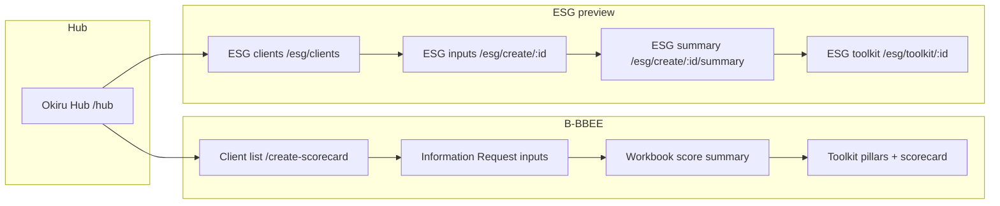

# ESG flow ontology (Okiru Pro v1.7)

How the ESG web app mirrors the B-BBEE workbook → toolkit journey, and how each Excel sheet feeds scorecards and the dashboard.

---

## 1. User journey (B-BBEE vs ESG)

| Step | B-BBEE (canonical) | ESG (preview) | Purpose |
|------|-------------------|---------------|---------|
| 0 | `/hub` | `/hub` | Product picker |
| 1 | `/create-scorecard` — pick/create company | `/esg/clients` | Tenant-scoped company list (`/api/clients`) |
| 2 | `/create-scorecard/:id` — section tabs, save | `/esg/create/:id` — E/S/G input sections | Capture workbook cells (`/api/esg/workbook/...`) |
| 3 | `/create-scorecard/:id/summary` | `/esg/create/:id/summary` | Validation gate + pillar preview |
| 4 | Toolkit `/` (dashboard, pillars, scorecard) | `/esg/toolkit/:id` | Read-only analytics, submit, export |

**API note:** ESG routes live on the **web** Express server (`/api/esg/*`), same as B-BBEE workbook (`/api/workbook/*`). Ingress must route `/api/esg` to the `web` service (not the `api` backend).

---

## 2. Sheet → input → scorecard → dashboard matrix

| Excel sheet | Web section key | Input layer? | Feeds (calculated) | End KPI / consumer |
|-------------|-----------------|--------------|-------------------|-------------------|
| Assumptions | `assumptions` | Yes | Rating thresholds, sector | Dashboard rating bands |
| E_Data | `e-data` | Yes | E_Scorecard, Carbon_Tax | E pillar %, GHG tCO₂e, net-zero |
| S_Data | `s-data` | Yes | S_Scorecard, EE_Scorecard | S pillar %, LTIFR, WSP |
| G_Data | `g-data` | Yes | G_Scorecard | G pillar maturity |
| EE_Scorecard | `ee` | Yes | S_Scorecard, Dashboard | EE % Black, targets |
| Fleet_Register | `fleet` | Yes (grid) | E_Data Scope 1 | Fleet L/100km, diesel tCO₂e |
| Waste_Register | `waste` | Yes (grid) | Dashboard KPI | Diversion % |
| Driver_Debrief | `driver-debrief` | Yes (grid) | ISO 14083 / fleet efficiency | Driver coaching |
| ISO_Tracker | `iso-tracker` | Yes (grid) | G_Scorecard | ISO 14001/45001/27001 |
| King5_Scorecard | `king5` | Yes (grid) | G_Scorecard, Dashboard | King V x/170 |
| IFRS_S1_S2 | `ifrs` | Yes (grid) | G_Scorecard, Dashboard | Climate disclosure % |
| GARP_GRAP | `garp` | Yes (grid) | Dashboard material risks | Risk count |
| SAQ_Supplier | `saq` | Yes (grid) | Procurement / S | Supplier ESG scores |
| E_Scorecard | — (derived) | No | ESG_Dashboard E row | Environmental score /108 |
| S_Scorecard | — (derived) | No | ESG_Dashboard S row | Social score /100 |
| G_Scorecard | — (derived) | No | ESG_Dashboard G row | Governance score /100 |
| ESG_Dashboard | — (derived) | No | Board pack | Overall ESG %, executive KPIs |
| Carbon_Tax | — (derived) | No | Tax liability view | Section 12L allowance |
| B_BBEE_ESG | — (bridge) | No | Links to B-BBEE workbook | Combined reporting |
| NetZero_Roadmap | — (derived) | No | Scenario charts | Path to net-zero |
| Data_Status / Validation / Audit_Log | — (meta) | No | QA only | Completeness, audit trail |
| Cover / Glossary / Standards_Map | — (reference) | No | UI copy, help | Terminology |

---

## 3. Web section keys ↔ workbook sheets

Defined in `apps/web/src/lib/esg/esgSections.ts` and `esgGridSections.ts`.

| Section key | Sheet name | Editor type |
|-------------|------------|-------------|
| `assumptions` | Assumptions | Meta fields |
| `e-data` | E_Data | Monthly period grid |
| `s-data` | S_Data | Social metrics |
| `g-data` | G_Data | Maturity sliders (0–5) |
| `ee` | EE_Scorecard | EE table |
| `fleet` | Fleet_Register | Row grid |
| `waste` | Waste_Register | Row grid |
| `driver-debrief` | Driver_Debrief | Row grid |
| `iso-tracker` | ISO_Tracker | Row grid |
| `king5` | King5_Scorecard | Row grid (17 principles) |
| `ifrs` | IFRS_S1_S2 | Row grid |
| `garp` | GARP_GRAP | Row grid |
| `saq` | SAQ_Supplier | Row grid |

---

## 4. What do I do first? {#what-do-i-do-first}

For consultants running an ESG engagement in Okiru Pro:

1. **Hub** — Open ESG from `/hub` (preview access required).
2. **Company** — On `/esg/clients`, select an existing B-BBEE client or create one (same `C-xxxxx` id as B-BBEE).
3. **Assumptions** — Set sector, reporting year, and stance floor before monthly data.
4. **Environmental** — Complete `e-data` (9 months) then `fleet` if Scope 1 is fleet-heavy.
5. **Social** — `s-data` and `ee` for headcount, LTIFR, WSP/ATR.
6. **Governance** — `g-data` sliders, then `king5` (all 17 statuses), `ifrs`, `garp`.
7. **Registers** — `waste`, `driver-debrief`, `iso-tracker`, `saq` as applicable.
8. **Save** — Each section autosaves to `PUT /api/esg/workbook/:id/section/:key`.
9. **Summary** — Fix critical validation blockers on `/esg/create/:id/summary`.
10. **Toolkit** — Open `/esg/toolkit/:id` for dashboard KPIs, submit, and XLSX export.

Glossary terms (GHG, Scope 1/2/3, King V, IFRS S2, etc.) match the workbook **Glossary** sheet — see `docs/esg/extracted/Glossary.md`.

### Section notes {#section-assumptions}

- **assumptions** — Sector, stance floor (B9), thresholds.
- **e-data** — 9 monthly periods: diesel, electricity, water.
- **s-data** — EE headcount, LTIFR, WSP/ATR.
- **g-data** — Column F: 0–5 maturity sliders.

(Other sections: see `ESG_INPUT_SECTIONS` notes in code.)

---

## 5. Same feeling as B-BBEE toolkit?

| Aspect | B-BBEE | ESG today | Gap / fix |
|--------|--------|-----------|-----------|
| Page chrome | `bg-black`, violet accent, `#2c2c2e` borders | Aligned (esg-glass.css) | — |
| Client picker | `/create-scorecard` | `/esg/clients` | Label "ESG Companies" vs "Select company" |
| Input UX | Section groups by sector, workbook grid | Flat ESG section list | No sector grouping yet |
| Summary step | In InformationRequest flow | Dedicated EsgScoreSummary | Same pattern ✓ |
| Toolkit | Full AppLayout + pillars | EsgToolkit shell | Fewer nav items; dashboard-first |
| API prefix | `/api/workbook` | `/api/esg` | Ingress must proxy to **web** |
| Permissions | Pillar RBAC | ESG preview allowlist | Different model by design |

**Quick UX wins applied:** neutral black background (not green glass wash); breadcrumbs Hub → ESG → Company → Inputs/Summary; section descriptions from workbook notes.

---

## 6. HTTP API (canonical)

| Method | Path | Handler |
|--------|------|---------|
| GET | `/api/esg/access` | Preview allowlist check |
| GET | `/api/esg/workbook/:companyId` | Load all sections |
| PUT | `/api/esg/workbook/:companyId/section/:sectionKey` | Save one section |
| POST | `/api/esg/workbook/:companyId/validate` | Validation ping |
| POST | `/api/esg/workbook/:companyId/submit` | Lock workbook |
| GET | `/api/esg/workbook/:companyId/scores` | Computed E/S/G scores |
| GET | `/api/esg/workbook/:companyId/export` | v1.7 XLSX download |

Implementation: `apps/web/server/esgWorkbookRoutes.ts`, registered from `apps/web/server/routes.ts`.
