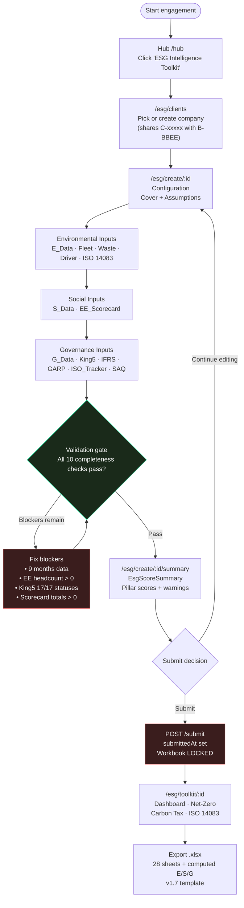

# ESG Flow Ontology — Okiru ESG Intelligence Toolkit v1.7

> **Single source of truth.** Read this before touching any ESG code, making any product decision, or preparing a client engagement. Every sheet, every formula, every UI field, every KPI is documented here.

**Workbook of truth:** `docs/esg/Okiru_ESG_Toolkit_v1_7_SG_Consumer_LiveData.xlsx` — 28 sheets, ~1,500 formulas, 209 cell-level data validations.  
**Extracted JSON:** `docs/esg/extracted/*.json` — machine-readable mirror used by tests and import code.  
**Screenshots:** `docs/esg/screenshots/*.png` — one per sheet.  
**Analysis companion:** [`ESG_TOOLKIT_ANALYSIS.md`](./ESG_TOOLKIT_ANALYSIS.md) — adversarial review with score parity findings.  
**Build plan:** [`ESG_IMPLEMENTATION_PLAN.md`](./ESG_IMPLEMENTATION_PLAN.md) — phased engineering roadmap (all phases complete as of June 2026).

---

## 1. Executive Summary

### 1.1 What the toolkit is

The Okiru ESG Intelligence Toolkit is a **structured, scored ESG engagement platform** built on a 28-tab Excel workbook that is fully mirrored in the web application. It enables a consultant and client to capture, score, and report on Environmental, Social, and Governance performance against South African legislative requirements and international frameworks (King V, IFRS S1/S2, GRI, ISO 14001/45001/27001, SBTi).

### 1.2 Who uses it

| Role | Primary responsibility |
|------|------------------------|
| **Engagement lead (consultant)** | Configuration: Cover, Assumptions, sector, stance, frameworks. Signs off submission. |
| **Operations data lead** | Monthly refresh of E_Data (fleet diesel, electricity, water) from Mariette Dashboard and utility bills. |
| **HR / EE manager** | S_Data EE headcount grid, EE_Scorecard, WSP/ATR training flags. |
| **SHEQ officer** | S_Data H&S, Waste_Register, Driver_Debrief, ISO_Tracker. |
| **Company secretary / governance lead** | G_Data board composition, King5_Scorecard, IFRS_S1_S2. |
| **Risk officer** | GARP_GRAP risk register, Materiality_Matrix. |
| **Procurement manager** | SAQ_Supplier assessment. |
| **Fleet manager** | Fleet_Register per-vehicle data. |

### 1.3 Connection to B-BBEE

The toolkit shares the company identifier (`C-xxxxx`) with the B-BBEE scorecard. The **B_BBEE_ESG bridge sheet** reads ESG inputs directly and maps them to Generic Code elements (Statement 000): EE_Scorecard feeds Management Control (19 pts), S_Data training feeds Skills Development (25 pts), and CSI/NPAT feeds SED (5 pts). Ownership (25 pts) and ESD (40 pts) remain manually entered. The bridge is one-way: ESG reads from B-BBEE data structures but does not write back to the existing B-BBEE toolkit store.

### 1.4 What the final ESG% means

The **Overall ESG score** (`ESG_Dashboard!D9`) is the equal-weighted average of each pillar's raw score expressed as a fraction of 100:

```
D9 = (E_Scorecard!D30/100  +  S_Scorecard!D28/100  +  G_Scorecard!D26/100) / 3
```

**Live SG Consumer values (FY 2025/26 YTD, 9 months to Mar-26):**

| Pillar | Raw score | Max | Workbook % | D9 contribution |
|--------|-----------|-----|------------|-----------------|
| Environmental | 36 | 108 | 33.3% | 36/100 = 0.36 |
| Social | 33 | 100 | 33.0% | 33/100 = 0.33 |
| Governance | 64.85 | 100 | 64.9% | 64.85/100 = 0.6485 |
| **Overall ESG** | — | — | **44.62%** | **(0.36+0.33+0.6485)/3** |

> **Critical nuance:** E is divided by 100 (not 108) in the D9 formula. This intentionally under-weights E relative to its 108-pt cap and means headline overall ≠ simple average of column D pillar percentages. Do not change this formula without a product decision and workbook version bump.

Rating bands (from `Assumptions!B62:B64`) apply against **individual pillar %** (D6/D7/D8), not D9.

---

## 2. Consultant Journey



---

## 3. Pillar Dependency Graph

```mermaid
flowchart TB
  subgraph CFG ["CONFIGURATION (set once)"]
    COV["Cover\nEntity · Period · Sector\nBaseline · NZ target"]
    ASS["Assumptions\nStance B6 → floor B9\nEmission factors\nThresholds THR_*\nRating bands"]
  end

  subgraph INP ["INPUT LAYER (data entry)"]
    ED["E_Data\nScope 1A fleet diesel\nScope 1B generator\nScope 1C LPG\nScope 1D cars\nScope 2 electricity\nSolar offset\nWater · Waste"]
    FR["Fleet_Register\nPer-vehicle L/100km\n~134 vehicles / 5 depots"]
    WR["Waste_Register\nOricol diversion %\nCority cardboard band"]
    DD["Driver_Debrief\nPer-trip km/stops\nFatigue flag"]
    ISO83["ISO_14083\nPer-trip WTW tCO₂e\ntonne-km allocation"]
    SD["S_Data\nEEA2 headcount grid\nWSP/ATR · H&S\nCSI · Payroll"]
    EE["EE_Scorecard\nEEA2 bands vs EAP\nB5–B14 inputs"]
    GD["G_Data\nBoard composition\nCommittees · Ethics\nPOPIA · Risk col F (0–5)"]
    K5["King5_Scorecard\n17 principles\nApply/Explain/Partial/Not"]
    IF["IFRS_S1_S2\n~22 disclosures\nDisclosed/Partial/No"]
    GP["GARP_GRAP\n~20 ESG risks\nSeverity × Likelihood"]
    IT["ISO_Tracker\n~60 clauses\n5 standards"]
    SAQ["SAQ_Supplier\n~46 suppliers\n7 criteria each"]
  end

  subgraph SCO ["SCORING LAYER (computed)"]
    ESC["E_Scorecard\nD30 = 36 / 108"]
    SSC["S_Scorecard\nD28 = 33 / 100"]
    GSC["G_Scorecard\nD26 = 64.85 / 100"]
  end

  subgraph DIS ["DISCLOSURE LAYER (derived)"]
    DASH["ESG_Dashboard\nD9 = 44.62%"]
    CT["Carbon_Tax\nTier 1/2 liability"]
    NZ["NetZero_Roadmap\nSBTi milestones"]
    MM["Materiality_Matrix\nDouble materiality"]
    BB["B_BBEE_ESG\nGeneric scorecard bridge"]
    VAL["Validation\n10 completeness checks\n+ GHG cross-check"]
  end

  ASS -->|THR_* · floor · EF_*| ESC & SSC & GSC & CT & BB
  COV -->|period labels · sector| ED & NZ
  ED --> ESC
  FR --> ESC
  WR --> ESC
  ISO83 -.->|parallel WTW| ESC
  SD --> SSC & EE
  EE --> SSC
  EE -->|E15/100 × 19| BB
  SD -->|training/payroll| BB
  GD --> GSC
  K5 -->|E21/170 × 25| GSC
  IF -->|COUNTIF Yes/total × 10| GSC
  GP --> GSC & MM
  IT --> GSC
  SAQ --> SSC
  DD -->|C59 fatigue gate| SSC
  ESC --> DASH & VAL
  SSC --> DASH & VAL
  GSC --> DASH & VAL
  ED --> CT & NZ
  MM -.->|topic weights| DASH
  CT --> DASH
  NZ --> DASH
```



**Master formula** (`ESG_Dashboard!D9`):

```excel
D9 = (E_Scorecard!D30/100 + S_Scorecard!D28/100 + G_Scorecard!D26/100) / 3
   = (36/100 + 33/100 + 64.8529/100) / 3
   = 44.6176%
```

TypeScript: `apps/web/EsgToolkit/src/lib/calculators/dashboard.ts::overallEsg(e, s, g)`

---

## 4. Sheet Inventory (All 28 Sheets)

| # | Sheet | Type | Purpose | Data owner | Entry method | Key input cells | Key output cells | Feeds |
|---|-------|------|---------|------------|--------------|-----------------|------------------|-------|
| 1 | Cover | DATA ENTRY | Entity metadata, reporting period, version | Consultant | Form | C5 entity, C6 period, C10 baseline yr, C11 NZ target yr, C12 sector | — | E_Data headers, Assumptions B8 prefill, NetZero B5/L5 |
| 2 | Assumptions | DATA ENTRY | Stance, sector, EF constants, thresholds, rating bands | Consultant (admin) | Form | B6 stance, B8 sector, B9 floor (formula), B11 currency, B13 carbon tier; B38–B54 THR_* | B9 banding floor | All scorecards, Carbon_Tax, NetZero, B_BBEE_ESG |
| 3 | Audit_Log | REFERENCE | Version change log | Consultant / Admin | Manual append | Author, section, description | — | — |
| 4 | ESG_Dashboard | AUTO | Master KPI dashboard | System | Computed | — | D6/D7/D8 pillar %, D9 overall | Final output |
| 5 | E_Data | DATA ENTRY | GHG inventory by scope, depot, month | Operations data lead | Monthly grid | C14:K18 fleet diesel, C44:K48 electricity, C61:K65 water | L79 Scope 1 tCO₂e, L82 Scope 2 tCO₂e | E_Scorecard, Carbon_Tax, NetZero, Validation |
| 6 | Fleet_Register | DATA ENTRY | Per-vehicle fuel norm tracking | Fleet manager | Row grid | J = monthly litres, I = monthly km | K = L/100km actual, M = tCO₂e | E_Scorecard row 8, Validation |
| 7 | ISO_14083 | DATA ENTRY | Transport GHG per trip (ISO 14083:2023) | Transport ops | Row grid | Distance, load, fuel used per trip | tCO₂e per trip, gCO₂e/t·km | E_Scorecard (Phase 2), customer Scope 3 |
| 8 | Waste_Register | DATA ENTRY | Oricol/Cority waste diversion data | SHEQ | Row grid + band | B16 Oricol diversion %, A11:J13 Cority band | Diversion %, landfill tCO₂e | E_Scorecard rows 20–22, ESG_Dashboard |
| 9 | Driver_Debrief | DATA ENTRY | Per-trip driver safety debrief | Operations | Row grid | Cust hit %, plan vs actual km, fatigue flag | C59 fatigue score | S_Scorecard row 19 |
| 10 | S_Data | DATA ENTRY | Social: EE headcount, H&S, training, CSI, payroll | HR + SHEQ | Headcount grid + scalar | L4:L11 EEA2 totals, G28–G35 H&S, B43 payroll, B44 NPAT | L12 total headcount, G35 LTIFR | S_Scorecard, EE_Scorecard, B_BBEE_ESG |
| 11 | G_Data | DATA ENTRY | Governance scalars + 0–5 maturity scores | Co Sec + Risk | Scalar form (col B) | B5 board total, B6–B9 composition %, B12–B24 Yes/No/Partial | F5:F26 0–5 scores (col F) | G_Scorecard rows 6–25 |
| 12 | EE_Scorecard | DATA ENTRY | Employment equity scoring | HR / EE manager | Row grid | B5 % Black, B6 % Black female, B8 % PWD, B9 EE plan, B10 forum | E15 total score | S_Scorecard rows 5–10, B_BBEE_ESG MC |
| 13 | E_Scorecard | AUTO | Environmental scoring (108 pts) | System | Computed | — | D30 total (= 36 live) | ESG_Dashboard D6, Validation |
| 14 | S_Scorecard | AUTO | Social scoring (100 pts) | System | Computed | — | D28 total (= 33 live) | ESG_Dashboard D7, Validation |
| 15 | G_Scorecard | AUTO | Governance scoring (100 pts) | System | Computed | — | D26 total (= 64.85 live) | ESG_Dashboard D8, Validation |
| 16 | King5_Scorecard | DATA ENTRY | King V 17 principles Apply & Explain | Co Secretary | Row grid (17 fixed rows) | C4:C30 status per principle | E21 total /170 | G_Scorecard row 5, Validation C12 |
| 17 | IFRS_S1_S2 | DATA ENTRY | IFRS S1/S2 disclosure checklist (~22 items) | Reporting lead | Row grid | D = Disclosed/Partial/Not | COUNTIF Disclosed / total | G_Scorecard rows 9–10 |
| 18 | GARP_GRAP | DATA ENTRY | ESG risk register (GARP ERM + GRAP PI) | Risk officer | Row grid | Severity, Control Status, Likelihood, Impact | Residual risk score | G_Scorecard rows 11–12, Materiality_Matrix |
| 19 | ISO_Tracker | DATA ENTRY | ISO 14001/45001/27001/26000 clause tracker (~60 rows) | SHEQ / Compliance | Row grid | Status per clause | Compliance % per standard | G_Scorecard rows 13–15, E_Scorecard ISO band |
| 20 | SAQ_Supplier | DATA ENTRY | Supplier self-assessment (IMS-T-149-02) | Procurement | Row grid | 7 score cols per supplier (1–5) | % score, rating A–E | S_Scorecard rows 26–27 |
| 21 | NetZero_Roadmap | AUTO | Decarbonisation pathway vs SBTi CNZS 2.0 | System | Computed | — | Target tCO₂e by year 2025–2050 | ESG_Dashboard net-zero section |
| 22 | B_BBEE_ESG | AUTO | Generic Code elements from ESG data | System | Computed | — | Points per element, B-BBEE level | Standalone bridge output |
| 23 | Materiality_Matrix | AUTO | Double materiality topic scoring | System | Computed | — | Material score = Severity × Likelihood × Impact / 4 | ESG_Dashboard (disclosure priority) |
| 24 | Carbon_Tax | AUTO | SA Carbon Tax Act liability (Tier 1 / Tier 2) | System | Computed | — | Net liability (ZAR) | ESG_Dashboard executive summary |
| 25 | Standards_Map | REFERENCE | Crosswalk: indicator → GRI / TCFD / IFRS / King V / ISO | Reference | Static | — | — | Glossary cross-links, auditors |
| 26 | Glossary | REFERENCE | 101 technical term definitions | Reference | Static | — | — | In-app help drawer |
| 27 | Validation | AUTO | Data completeness + GHG cross-check | System | Computed | — | Pass/Fail per check | Submit gate |
| 28 | Data_Status | DATA ENTRY | Field-level completion tracker | Engagement PM | Manual flags | Status per field (Confirmed/Outstanding/Estimated) | — | Toolkit completeness tile (Phase 2) |

---

## 5. Formula → Score → KPI Chain

### 5.1 Scoring primitives (all scorecards use these patterns)

| Pattern | Workbook formula | TypeScript | When used |
|---------|-----------------|------------|-----------|
| Pro-rata | `IF(actual/target>=1,max, IF(actual/target>=floor,max×actual/target,0))` | `pr(actual,target,max,floor)` | E rows 1–4, S EE, training ratios |
| Inverse LTIFR | `IF(G35<=THR,8, IF(G35<=THR/B9,MAX(0,8×(1+B9-G35/THR)),0))` | `prLtifr(ltifr,thr,8,floor)` | S_Scorecard row 17 |
| Banded binary | `IF(B="Yes",max, IF(B="Partial",max/2, 0))` | `bandedBn(status,max)` | G_Data Yes/Partial/No rows |
| Maturity (0–5) | `G_Data!F* → G_Scorecard direct ref` | `governanceMaturity(f,max)` | G_Scorecard rows 6–25 |
| MIN cap | `=MIN(score,max)` on D column | `minCap(score,max)` | All scorecard D columns |
| Status band | `IF(D>=max,"✓ Met",IF(D>=max×0.5,"⚠ Partial","✗ Gap"))` | `statusBand(score,max)` | All scorecard F columns |

**Banding floor** (`Assumptions!B9`): computed by `=IF(B6="Lean",0.3,IF(B6="Strict",0.7,0.5))` — used as the partial-credit floor in all `pr()` and `bandedBn()` calls.

### 5.2 Environmental scorecard (`E_Scorecard` — 108 pts max)

| Row | Indicator | Max pts | Formula pattern | Primary input | Live score |
|-----|-----------|---------|----------------|---------------|------------|
| D5 | GHG Scope 1 baseline tracked | 5 | `IF(E_Data!L19>0,5,0)` | E_Data!L19 fleet diesel YTD | 5 |
| D6 | GHG Scope 1 YoY reduction ≥10% | 10 | `pr((baseline-current)/baseline, THR_GHG_YOY, 10, floor)` | E_Data B90 baseline, F90 current | 0 |
| D7 | GHG Scope 2 net reduction (solar) | 8 | `pr(solar_kWh/elec_kWh, THR_RE, 8, floor)` | E_Data solar vs grid | 0 |
| D8 | GHG Scope 3 tracking | 5 | Existence flag (water + waste > 0) | E_Data rows 61/71 | 5 |
| D9 | Net-zero SBTi target set | 5 | `IF(Assumptions!B107>=2030,5,0)` | Assumptions!B107 | 0 |
| D11 | Energy kWh tracked 9 months | 5 | `COUNTIF(E_Data!C44:K44,">0")=9` | E_Data electricity grid | 5 |
| D12 | Energy efficiency YoY improvement | 5 | `pr(prior_kWh - current_kWh, target, 5, floor)` | E_Data prior period | 0 |
| D13 | Fleet L/100km within norm | 8 | `SUMPRODUCT(vehicles_within_norm)/total×8` | Fleet_Register col K vs L | 3 |
| D14 | EV % of fleet ≥ THR_EV | 5 | `pr(ev_count/fleet_total, THR_EV, 5, floor)` | E_Data scalar EV flag | 0 |
| D16 | Waste diversion ≥75% (THR_WASTE) | 5 | `pr(diversion_pct, 0.75, 5, floor)` | Waste_Register B16 | 3 |
| D17 | Waste cardboard recycling | 4 | Average Cority band % | Waste_Register / E_Data | 2 |
| D18 | Water tracked monthly | 4 | `COUNTIF(E_Data!C61:K61,">0")=9` | E_Data water grid | 4 |
| D19 | Water efficiency initiative | 3 | `bandedBn(B=Yes/Partial,3)` | E_Data scalar | 0 |
| D20 | ISO 14001 certified/in progress | 8 | ISO_Tracker rows 26–29 compliance % | ISO_Tracker | 4 |
| D21 | Environmental aspects register | 4 | `bandedBn(aspects_status,4)` | E_Data scalar | 2 |
| D22 | Environmental policy documented | 4 | `bandedBn(policy_status,4)` | E_Data scalar | 3 |
| D23 | NEMA/NWA/NEMWA legal compliance | 4 | `bandedBn(legal_status,4)` | E_Data scalar | 0 |
| **D30** | **Total** | **108** | `=SUM(D5:D28)` | — | **36** |

**E_Scorecard row-by-row (complete):**

| Row | Indicator | Band | Max pts | Formula pattern | Live |
|-----|-----------|------|---------|----------------|------|
| D5 | GHG Scope 1 baseline tracked (fleet diesel > 0) | GHG | 5 | `IF(E_Data!L19>0,5,0)` | 5 |
| D6 | Scope 1 YoY reduction ≥10% | GHG | 10 | `pr((B90-F90)/B90, 0.10, 10, floor)` | 0 |
| D7 | Scope 2 net reduction via solar | GHG | 8 | `pr(solar_kWh/elec_kWh, THR_RE, 8, floor)` | 0 |
| D8 | Scope 3 tracking (water + waste) | GHG | 5 | `IF(E_Data!L63>0 AND L71>0, 5, 2.5 if one)` | 5 |
| D9 | SBTi net-zero target year set | GHG | 5 | `IF(Assumptions!B107>=2030,5,0)` | 0 |
| D11 | Energy kWh tracked all 9 months | Energy | 5 | `IF(COUNTIF(E_Data!C44:K44,">0")=9,5,0)` | 5 |
| D12 | Energy efficiency YoY improvement | Energy | 5 | `pr(prior_kWh-current_kWh, target_delta, 5, floor)` | 0 |
| D13 | Fleet L/100km ≤ norm (% vehicles) | Energy | 8 | `MIN(SUMPRODUCT(within_norm)/count,1)×8` | 3 |
| D14 | EV % of fleet ≥ threshold | Energy | 5 | `pr(ev_count/fleet_total, THR_EV, 5, floor)` | 0 |
| D16 | Waste diversion rate ≥75% | Waste | 5 | `pr(Waste_Register!B16, 0.75, 5, floor)` | 3 |
| D17 | Cardboard recycling (Cority avg) | Waste | 4 | `pr(avg_cority_pct, THR_CORITY, 4, floor)` | 2 |
| D18 | Water consumption tracked 9 months | Water | 4 | `IF(COUNTIF(E_Data!C61:K61,">0")=9,4,0)` | 4 |
| D19 | Water efficiency initiative | Water | 3 | `bandedBn(E_Data!water_eff_flag, 3)` | 0 |
| D20 | ISO 14001 certified or in progress | ISO/EMS | 8 | ISO_Tracker rows 26–29 compliance average × 8 | 4 |
| D21 | Environmental aspects register | ISO/EMS | 4 | `bandedBn(E_Data!aspects_flag, 4)` | 2 |
| D22 | Environmental policy documented | ISO/EMS | 4 | `bandedBn(E_Data!env_policy_flag, 4)` | 3 |
| D23 | NEMA/NWA/NEMWA legal compliance | ISO/EMS | 4 | `bandedBn(E_Data!legal_compliance_flag, 4)` | 0 |
| D24 | Net-zero roadmap milestones tracked | Net-Zero | 5 | `IF(NetZero!gap_2030<=0,5,pr(1-gap/baseline,0,5,floor))` | 0 |
| D25 | Carbon tax liability calculated | Net-Zero | 5 | `IF(Carbon_Tax!liability>0,5,0)` | 0 |
| D26 | Fleet electrification roadmap | Net-Zero | 5 | `bandedBn(fleet_ev_plan, 5)` | 0 |
| D27 | Renewable energy procurement plan | Net-Zero | 5 | `bandedBn(re_plan_flag, 5)` | 0 |
| D28 | Transport ISO 14083 tonne-km tracked | Net-Zero | 5 | `IF(ISO_14083 rows>0, 5, 0)` | 0 |
| **D30** | **Total** | — | **108** | `=SUM(D5:D28)` | **36** |

> Note: Rows D10, D15 are section header rows (no score). Total cell is D30 = SUM of D-column scoring rows across all bands.

### 5.3 Social scorecard (`S_Scorecard` — 100 pts max)

| Band | Rows | Max pts | Primary source | Live score |
|------|------|---------|---------------|------------|
| Employment Equity | D5–D10 | 30 | EE_Scorecard B5/B6/B8, S_Data L4:L11 EEA2 | 11 |
| WSP/ATR submission | D12–D15 | 20 | S_Data B43–B49, WSP/ATR flags | 0 |
| Health & Safety | D17–D20 | 25 | S_Data G28–G35 (LTIFR, fatalities, incidents), Driver_Debrief C59 | 17 |
| Community / CSI | D22–D24 | 15 | S_Data CSI/NPAT, initiatives COUNT A72:A79 | 5 |
| Supplier H&S / food safety | D26–D27 | 10 | SAQ_Supplier avg score | 0 |
| **D28** | **Total** | **100** | `=SUM(D5,D6,...,D27)` (skips header rows) | **33** |

**LTIFR formula** (`S_Scorecard!D17`, 8 pts max):
```excel
=IF(S_Data!G35<=Assumptions!B55, 8,
   IF(S_Data!G35<=Assumptions!B55/Assumptions!B9,
      MAX(0, 8*(1+Assumptions!B9 - S_Data!G35/Assumptions!B55)),
   0))
```
Where `G35 = IF(G28=0,0,(G29/G28)*200000)`. Empty/zero LTIFR → **0 pts** (workbook behaviour; web must match).

### 5.4 Governance scorecard (`G_Scorecard` — 100 pts max)

| Band | Rows | Max pts | Primary source | Live score |
|------|------|---------|---------------|------------|
| King V score ≥70% | D5 | 25 | `King5!E21/170×25` | ~10 |
| King V S&EC established | D6 | 5 | `G_Data!F13` (0–5 maturity) | 5 |
| ESG-linked remuneration | D7 | 5 | `G_Data!F14` | 2.5 |
| IFRS S1/S2 disclosures | D9 | 10 | `COUNTIF(IFRS!D4:D40,"Disclosed")/total×10` | 5 |
| Climate risk on board agenda | D10 | 5 | `G_Data!F(climate_risk)` | 5 |
| GARP ERM includes ESG | D11 | 8 | `bandedBn(GARP_control_status,8)` | 8 |
| GRAP public interest compliance | D12 | 5 | `IF(G_Data!B(PI)>=THR_PI,5,pr(...))` | 5 |
| POPIA IO appointed | D13 | 5 | `G_Data!F(popia_io)` | 5 |
| Cyber/data risk assessed | D14 | 5 | `G_Data!F(cyber_risk)` | 2.5 |
| Integrated report published | D15 | 8 | `G_Data!F(int_report)` | 4 |
| External assurance | D16 | 5 | `G_Data!F(ext_assurance)` | 0 |
| Code of ethics + whistleblower | D18–D19 | 4 | `G_Data!F(ethics)+F(whistleblower)` | 4 |
| Legal register maintained | D20 | 5 | `G_Data!F(legal_reg)` | 5 |
| No material penalties | D21 | 5 | `IF(G_Data!B(penalties)=0,5,0)` | 3 |
| **D26** | **Total** | **100** | `=SUM(D5:D24)` | **64.85** |

**Note:** G_Data column F (0–5 maturity scores) is the canonical governance input for scoring, not boolean Yes/No. Each G_Scorecard row references `G_Data!F*` directly.

### 5.5 ESG_Dashboard aggregation (`D9`)

```excel
D6 = E_Scorecard!D30 / 108      → 33.3% (pillar display %)
D7 = S_Scorecard!D28 / 100      → 33.0%
D8 = G_Scorecard!D26 / 100      → 64.9%
D9 = (E_Scorecard!D30/100 + S_Scorecard!D28/100 + G_Scorecard!D26/100) / 3
   = 44.6176%
```

Rating band determination (uses pillar %, not D9):
```excel
D10 = IF(D6 >= Assumptions!B62, "★★★ Excellent",
         IF(D6 >= B63, "★★ Good",
            IF(D6 >= B64, "★ Adequate", "⚠ Attention")))
```

---

## 6. Validation Rule Reference

### 6.1 Submit blockers (hard errors — prevent submission)

| Rule ID | Trigger condition | Check cell | Workbook source | Blocking? |
|---------|------------------|------------|-----------------|-----------|
| `cover.entity-required` | `Cover!C5` blank | — | New (app-level) | YES |
| `assumptions.sector-required` | `Assumptions!B8` blank | — | New (app-level) | YES |
| `e-data.fleet.months-complete` | `COUNTIF(E_Data!C14:K14,">0") < 9` | Validation!C5 | Validation row 5 | YES |
| `e-data.electricity.months-complete` | `COUNTIF(E_Data!C44:K44,">0") < 9` | Validation!C6 | Validation row 6 | YES |
| `e-data.water.months-complete` | `COUNTIF(E_Data!C61:K61,">0") < 9` | Validation!C7 | Validation row 7 | YES |
| `s-data.headcount-positive` | `S_Data!L12 = 0` | Validation!C8 | Validation row 8 | YES |
| `e-scorecard.total-positive` | `E_Scorecard!D30 = 0` | Validation!C9 | Validation row 9 | YES |
| `s-scorecard.total-positive` | `S_Scorecard!D28 = 0` | Validation!C10 | Validation row 10 | YES |
| `g-scorecard.total-positive` | `G_Scorecard!D26 = 0` | Validation!C11 | Validation row 11 | YES |
| `king5.principles-complete` | `COUNTA(King5!C4:C30) ≠ 17` | Validation!C12 | Validation row 12 | YES |

### 6.2 Warnings (non-blocking)

| Warning ID | Condition | Section | Message |
|------------|-----------|---------|---------|
| `ifrs.disclosures-entered` | `COUNTA(IFRS!D4:D40) = 0` | IFRS | No IFRS disclosure statuses entered |
| `fleet.register-populated` | `COUNTA(Fleet_Register!A4:A30) = 0` | Fleet | Fleet register is empty; E_Scorecard row 8 will score 0 |
| `waste.oricol-loaded` | `Waste_Register!D5 = 0` | Waste | Oricol waste data missing; diversion % = 0 |
| `driver.debrief-loaded` | `COUNTA(Driver_Debrief!C4:C15) = 0` | Driver | Driver debrief empty; fatigue gate for S row 19 = 0 |
| `g-data.board-count-positive` | `G_Data!B5 = 0` | Governance | Board member count = 0; all board rows score 0 |
| `assumptions.nz-year-set` | `Assumptions!B107` blank | Assumptions | SBTi NZ target year not set; E_Scorecard D9 = 0 |

### 6.3 GHG cross-check block (`Validation!A19:E32`)

Manual expected tCO₂e totals per depot are entered in col B (rows 19–32); col C pulls computed values from E_Data; col D flags Pass/Fail. Used for audit reconciliation. Not a submit blocker — consultant-reviewable only.

---

## 7. API Endpoint Reference

All endpoints served by `apps/web/server/esgWorkbookRoutes.ts` (Express), proxied via ingress `/api/esg/*` → web pod. Persistence: MongoDB `esg_workbooks` collection `{ companyId, sections, submittedAt, updatedAt }` with in-memory fallback.

| Method | Path | Auth | Request body | Response | Notes |
|--------|------|------|-------------|----------|-------|
| GET | `/api/esg/access` | session | — | `{ allowed: boolean }` | `canAccessEsgToolkit(user)` allowlist check |
| GET | `/api/esg/workbook/:companyId` | session + access | — | `{ companyId, sections, updatedAt, submittedAt }` | Full workbook load |
| PUT | `/api/esg/workbook/:companyId/section/:sectionKey` | session + access | `{ cells: Record<string,any> }` | `{ updatedAt }` | Atomic section save; HTTP 423 if `submittedAt` set |
| POST | `/api/esg/workbook/:companyId/seed-demo` | session + access | — | `{ seeded: true }` | Server-side SG Consumer golden fixture seed |
| POST | `/api/esg/workbook/:companyId/import` | session + access | multipart `file=<xlsx>` | `{ preview: sections }` | Parse v1.7 xlsx, return preview (no write) |
| POST | `/api/esg/workbook/:companyId/validate` | session + access | — | `{ issues: EsgValidationIssue[] }` | Full validation ping |
| POST | `/api/esg/workbook/:companyId/submit` | session + access | — | `{ submittedAt }` or HTTP 422 | Locks workbook; requires all 10 blockers clear |
| GET | `/api/esg/workbook/:companyId/scores` | session + access | — | `{ environmental, social, governance, overall, kpis }` | Computed E/S/G scores |
| GET | `/api/esg/workbook/:companyId/export` | session + access | — | `.xlsx` download | 28-sheet v1.7 export with computed scorecard values |

**Section key → PUT path mapping:**
`e-data` → `/section/e-data`, `fleet` → `/section/fleet`, `s-data` → `/section/s-data`, `g-data` → `/section/g-data`, `ee` → `/section/ee`, `waste` → `/section/waste`, `driver-debrief` → `/section/driver-debrief`, `iso-tracker` → `/section/iso-tracker`, `king5` → `/section/king5`, `ifrs` → `/section/ifrs`, `garp` → `/section/garp`, `saq` → `/section/saq`

---

## 8. Web ↔ Workbook Crosswalk

| # | Section key | Sheet | Nav label | Editor type | Screenshot | JSON extract |
|---|-------------|-------|-----------|-------------|------------|--------------|
| 1 | `cover` | Cover | Company Info | `EsgScalarForm` | [Cover.png](./screenshots/Cover.png) | [Cover.json](./extracted/Cover.json) |
| 2 | `assumptions` | Assumptions | Settings | `EsgScalarForm` | [Assumptions.png](./screenshots/Assumptions.png) | [Assumptions.json](./extracted/Assumptions.json) |
| 3 | `e-data` | E_Data | Environmental Data | `EsgSubtabContainer` of `EsgMonthlyGrid` (5 depots × 9 months) | [E_Data.png](./screenshots/E_Data.png) | [E_Data.json](./extracted/E_Data.json) |
| 4 | `s-data` | S_Data | Social Data | `EsgHeadcountGrid` (EEA2) + `EsgScalarForm` (H&S, training, CSI, payroll) | [S_Data.png](./screenshots/S_Data.png) | [S_Data.json](./extracted/S_Data.json) |
| 5 | `g-data` | G_Data | Governance Data | `EsgMaturityGrid` (col B inputs + col F 0–5 scores) | [G_Data.png](./screenshots/G_Data.png) | [G_Data.json](./extracted/G_Data.json) |
| 6 | `ee` | EE_Scorecard | Employment Equity | `EsgMaturityGrid` (B5–B14 inputs) | [EE_Scorecard.png](./screenshots/EE_Scorecard.png) | [EE_Scorecard.json](./extracted/EE_Scorecard.json) |
| 7 | `fleet` | Fleet_Register | Fleet Register | `SpreadsheetGrid` (per-vehicle rows) | [Fleet_Register.png](./screenshots/Fleet_Register.png) | [Fleet_Register.json](./extracted/Fleet_Register.json) |
| 8 | `waste` | Waste_Register | Waste Register | `SpreadsheetGrid` + monthly recycling band | [Waste_Register.png](./screenshots/Waste_Register.png) | [Waste_Register.json](./extracted/Waste_Register.json) |
| 9 | `driver-debrief` | Driver_Debrief | Driver Debrief | `SpreadsheetGrid` (per-trip rows) | [Driver_Debrief.png](./screenshots/Driver_Debrief.png) | [Driver_Debrief.json](./extracted/Driver_Debrief.json) |
| 10 | `iso-tracker` | ISO_Tracker | ISO Compliance | `SpreadsheetGrid` (fixed ~60 clause rows) | [ISO_Tracker.png](./screenshots/ISO_Tracker.png) | [ISO_Tracker.json](./extracted/ISO_Tracker.json) |
| 11 | `king5` | King5_Scorecard | King V | `SpreadsheetGrid` (17 fixed principle rows) | [King5_Scorecard.png](./screenshots/King5_Scorecard.png) | [King5_Scorecard.json](./extracted/King5_Scorecard.json) |
| 12 | `ifrs` | IFRS_S1_S2 | IFRS S1/S2 | `SpreadsheetGrid` (~22 disclosure rows) | [IFRS_S1_S2.png](./screenshots/IFRS_S1_S2.png) | [IFRS_S1_S2.json](./extracted/IFRS_S1_S2.json) |
| 13 | `garp` | GARP_GRAP | Risk Register | `SpreadsheetGrid` (~20 risk rows) | [GARP_GRAP.png](./screenshots/GARP_GRAP.png) | [GARP_GRAP.json](./extracted/GARP_GRAP.json) |
| 14 | `saq` | SAQ_Supplier | Supplier SAQ | `SpreadsheetGrid` (per-supplier rows, 7 criteria) | [SAQ_Supplier.png](./screenshots/SAQ_Supplier.png) | [SAQ_Supplier.json](./extracted/SAQ_Supplier.json) |
| 15 | `iso-14083` | ISO_14083 | Transport Emissions | `SpreadsheetGrid` *(Phase 2)* | [ISO_14083.png](./screenshots/ISO_14083.png) | [ISO_14083.json](./extracted/ISO_14083.json) |
| — | *(derived)* | E_Scorecard | E Dashboard | Read-only summary | [E_Scorecard.png](./screenshots/E_Scorecard.png) | [E_Scorecard.json](./extracted/E_Scorecard.json) |
| — | *(derived)* | S_Scorecard | S Dashboard | Read-only summary | [S_Scorecard.png](./screenshots/S_Scorecard.png) | [S_Scorecard.json](./extracted/S_Scorecard.json) |
| — | *(derived)* | G_Scorecard | G Dashboard | Read-only summary | [G_Scorecard.png](./screenshots/G_Scorecard.png) | [G_Scorecard.json](./extracted/G_Scorecard.json) |
| — | *(derived)* | ESG_Dashboard | Dashboard | Toolkit landing page | [ESG_Dashboard.png](./screenshots/ESG_Dashboard.png) | [ESG_Dashboard.json](./extracted/ESG_Dashboard.json) |
| — | *(derived)* | Carbon_Tax | Carbon Tax | Toolkit page | [Carbon_Tax.png](./screenshots/Carbon_Tax.png) | [Carbon_Tax.json](./extracted/Carbon_Tax.json) |
| — | *(derived)* | NetZero_Roadmap | Net-Zero Roadmap | Toolkit page | [NetZero_Roadmap.png](./screenshots/NetZero_Roadmap.png) | [NetZero_Roadmap.json](./extracted/NetZero_Roadmap.json) |
| — | *(derived)* | Materiality_Matrix | Materiality | Toolkit panel | [Materiality_Matrix.png](./screenshots/Materiality_Matrix.png) | [Materiality_Matrix.json](./extracted/Materiality_Matrix.json) |
| — | *(bridge)* | B_BBEE_ESG | B-BBEE Bridge | Toolkit panel | [B_BBEE_ESG.png](./screenshots/B_BBEE_ESG.png) | [B_BBEE_ESG.json](./extracted/B_BBEE_ESG.json) |
| — | `validation-view` | Validation | Validation | Read-only panel | [Validation.png](./screenshots/Validation.png) | [Validation.json](./extracted/Validation.json) |
| — | `standards-map-view` | Standards_Map | Standards Map | Read-only table | [Standards_Map.png](./screenshots/Standards_Map.png) | [Standards_Map.json](./extracted/Standards_Map.json) |
| — | `glossary-view` | Glossary | Help / Glossary | Inline help drawer | [Glossary.png](./screenshots/Glossary.png) | [Glossary.json](./extracted/Glossary.json) |
| — | `audit-log-view` | Audit_Log | Audit Log | Read-only list | [Audit_Log.png](./screenshots/Audit_Log.png) | [Audit_Log.json](./extracted/Audit_Log.json) |
| — | `data-status-view` | Data_Status | Data Status | Toolkit tracker *(Phase 2)* | [Data_Status.png](./screenshots/Data_Status.png) | [Data_Status.json](./extracted/Data_Status.json) |

---

## 9. How to Run an ESG Engagement — Step-by-Step

This guide is written for a consultant who has never used the Okiru ESG toolkit. All steps reference concrete UI actions and workbook cell locations.

**Step 1 — Allowlist check.** Confirm the user has ESG toolkit access (`GET /api/esg/access → { allowed: true }`). If not, contact the Okiru admin to add the account to the allowlist.

**Step 2 — Create or select the client company.** Navigate to `/esg/clients`. If the client already exists in the B-BBEE toolkit under a `C-xxxxx` ID, select that same entity — ESG and B-BBEE share the company record. If new, create a company with `toolkitType: 'esg'`. The company ID will be used in all subsequent URLs as `:companyId`.

**Step 3 — Complete Cover.** Open the Cover section. Enter: entity name (`Cover!C5`), reporting period in the format `FY 2025/2026 | Jul 2025 – Jun 2026` (`C6`), consultant name (`C7`), baseline year for SBTi (`C10`), net-zero target year (`C11`, typically 2050), and sector (`C12`). These values propagate to E_Data column headers and NetZero_Roadmap baselines.

**Step 4 — Configure Assumptions.** Open Assumptions. Set: scoring stance (`B6` — Standard is default; Lean = 30% partial-credit floor, Strict = 70%), sector (`B8` — must match Cover C12), primary reporting standard (`B9` — typically King V + IFRS S1/S2), materiality approach (`B10`), currency (`B11`), and carbon tax display basis (`B13`). **Do not change the sector dropdown mid-engagement** — the template is instance-locked.

**Step 5 — Environmental data entry.** Open E_Data. For each month (columns C–K = Jul–Mar), enter:
- Scope 1A fleet diesel litres per depot (rows 14–18: BLOEM, CPT, DBN, ISANDO, PE)
- Scope 1B generator diesel per depot (rows 21–25)
- Scope 1C LPG forklifts (row 32 — DBN depot only for SG Consumer)
- Scope 1D business car fuel (row 37)
- Scope 2 grid electricity kWh per depot (rows 44–48) and solar kWh (rows 50–54)
- Water consumption kL per depot (rows 61–65)
- Waste recycling % (rows 68–71)

Source systems: Mariette Dashboard (fleet/generator), utility bills (electricity/water), Oricol/Cority (waste).

**E_Data depot/scope entry grid (reference):**

| Scope | Source | Row range | Depot rows | Month cols | Unit |
|-------|--------|-----------|------------|------------|------|
| 1A Fleet diesel | Mariette Dashboard | 14–18 | BLOEM=14, CPT=15, DBN=16, ISANDO=17, PE=18 | C–K | Litres |
| 1B Generator diesel | Mariette Dashboard | 21–25 | Same 5 depots | C–K | Litres |
| 1C LPG forklifts | Mariette Dashboard | 32 | DBN only | C–K | kg |
| 1D Business cars | Mariette Dashboard | 37 | 1 vehicle | C–K | Litres |
| 2 Electricity | Utility bills | 44–48 | 5 depots | C–K | kWh |
| 2 Solar generation | Solar inverter | 50–54 | 5 depots | C–K | kWh (entered positive, formula negates) |
| 3 Water | Utility bills | 61–65 | 5 depots | C–K | kL |
| 3 Waste % recycled | Oricol/Cority | 68–71 | Mixed (Oricol by depot; Cority avg) | C–K | % |

**Step 6 — Operational registers.** Populate:
- **Fleet_Register**: per-vehicle monthly km and litres (col I and J). L/100km actual (`K = IFERROR(J/I*100,0)`) and tCO₂e (`M = J × 2.68/1000`) are computed.
- **Waste_Register**: Oricol diversion % for waste streams + Cority cardboard recycling monthly band (rows A11:J13).
- **Driver_Debrief**: per-trip date, depot, driver, vehicle reg, actual vs planned km, customer hit %, fatigue flag. Row 59 (`C59`) is the fatigue-gate value feeding S_Scorecard row 19.
- **ISO_Tracker**: for each of the ~60 ISO clauses, select Status (`Fully Compliant / Partially Compliant / Gap / Not Applicable`).

**Step 7 — Social data entry.** Open S_Data:
- EEA2 headcount grid: enter total head-count per occupational level (L1–L6 + management), broken down by race/gender groups. `L12` = total headcount is a validation-blocker cell — it must be > 0.
- H&S block: enter lost-time injuries (`G29`), total hours worked (`G28`), fatalities. LTIFR computes as `G35 = IF(G28=0,0,(G29/G28)×200000)`.
- Training: enter payroll (`B43`), NPAT (`B44`), total training spend, black training spend, WSP/ATR submission flags.
- CSI: enter CSI spend, NPAT (for 1% target ratio), initiative count.

**Step 8 — EE_Scorecard.** Open EE_Scorecard and confirm/enter: `B5` % Black employees, `B6` % Black female, `B7` % Black L1+L2 management, `B8` % PWD, `B9` EE plan status, `B10` EE forum active, `B11`–`B14` remaining EE programme flags. Cell E15 (total score) feeds S_Scorecard EE band and B_BBEE_ESG Management Control.

**Step 9 — Governance inputs.** Open G_Data and enter board composition (B5 total directors, B6 independent NEDs, B7 executive directors, B8 % Black board, B9 % female board, B10 board meetings YTD) and dropdown fields B12–B24 for committees, ethics, POPIA, risk management (Yes/Partial/No/N/A). Column F scores (0–5 maturity) compute automatically and feed G_Scorecard directly.

**Step 10 — Sub-register inputs.** Complete:
- **King5_Scorecard**: for each of 17 principles (rows 4–20), select `Applied / Explained / Partially Applied / Not Applied` in column C. All 17 rows **must** have a status to clear the submit blocker (`COUNTA(C4:C30) = 17`). Total `E21` feeds G_Scorecard row 5.
- **IFRS_S1_S2**: for each disclosure requirement, select `Disclosed / Partially Disclosed / Not Disclosed / N/A` in column D. COUNTIF feeds G_Scorecard IFRS band.
- **GARP_GRAP**: for each risk, set Severity (1–5), Control Status, Likelihood (1–5), Impact (1–5). Residual risk auto-computes; feeds Materiality_Matrix.
- **SAQ_Supplier**: for each supplier, score 7 criteria (1–5). % Score and rating A–E auto-compute; feeds S_Scorecard rows 26–27.

**Step 11 — Check validation panel.** Navigate to the Validation view or open `/esg/create/:id/summary`. Review all 10 completeness checks. The red blockers must all clear before submission. Common issues: missing months of E_Data (must be 9 completed months each for fleet diesel, electricity, water), zero EE headcount in S_Data L12, fewer than 17 King V statuses. Fix each issue in the relevant section.

**Step 12 — Submit.** From the Score Summary page, confirm E/S/G pillar scores and overall ESG%. Click "Submit workbook". The server sets `submittedAt`, locks all editors, and the workbook enters read-only state. All PUT requests to the workbook will return HTTP 423 after this point.

**Step 13 — Export and deliver.** Navigate to the Toolkit dashboard (`/esg/toolkit/:id`). Review KPI cards (Scope 1+2 tCO₂e YTD, LTIFR, ESG%, net-zero pathway). Click "Export .xlsx" to download the 28-sheet workbook with computed E_Scorecard, S_Scorecard, G_Scorecard, and ESG_Dashboard values embedded. Deliver the export to the client along with the Toolkit PDF report.

---

## 10. Sector Norms & Assumptions Reference

### 10.1 Emission factors (E_Data rows 4–10; mirrored from Assumptions)

| Code | Cell | Value | Unit | Source | Used by |
|------|------|-------|------|--------|---------|
| EF_DIESEL | E_Data!B4 / Assumptions!B38 | 2.68 | kgCO₂e/L | DEFRA 2024 | Scope 1A fleet, Scope 1B generator |
| EF_PETROL | E_Data!B5 / Assumptions!B39 | 2.31 | kgCO₂e/L | DEFRA 2024 | Scope 1D business cars |
| EF_LPG | E_Data!B6 / Assumptions!B40 | 1.51 | kgCO₂e/kg | DEFRA 2024 | Scope 1C LPG forklifts |
| EF_ELEC | E_Data!B7 / Assumptions!B41 | 0.82 | kgCO₂e/kWh | Eskom NERSA 2024 | Scope 2 electricity |
| EF_SOLAR | E_Data!B8 / Assumptions!B42 | 0.025 | kgCO₂e/kWh | Solar PV lifecycle | Solar offset (negative) |
| EF_WATER | E_Data!B9 / Assumptions!B43 | 0.000344 | tCO₂e/kL | GHG Protocol Scope 3 | Scope 3 water |
| EF_LANDFILL | E_Data!B10 / Assumptions!B44 | 0.58 | tCO₂e/tonne | NEMWA waste hierarchy | Scope 3 landfill |

### 10.2 Scoring stance

| Stance | Cell B6 | Banding floor B9 | Meaning |
|--------|---------|-----------------|---------|
| Lean | "Lean" | 0.30 (30%) | Partial credit awarded when actual ≥ 30% of target |
| Standard | "Standard" | 0.50 (50%) | Default — partial credit ≥ 50% of target |
| Strict | "Strict" | 0.70 (70%) | Audit-grade — partial credit ≥ 70% of target |

Formula: `B9 = IF(B6="Lean",0.3,IF(B6="Strict",0.7,0.5))`

### 10.3 Threshold registry (Assumptions rows 43–65; codes THR_*)

| Code | Approx. cell | Value | Unit | Used by |
|------|-------------|-------|------|---------|
| THR_GHG_YOY | B43 | 10% | reduction YoY | E_Scorecard Scope 1 YoY row |
| THR_RE | B44 | 20% | renewable % of electricity | E_Scorecard solar offset row |
| THR_FUEL_TOL | B45 | 1.05 | L/100km tolerance multiplier | E_Scorecard fleet norm row (SUMPRODUCT) |
| THR_EV_MIN | B46 | (sector-specific) | % EV of fleet | E_Scorecard EV % row |
| THR_WASTE | B48 | 0.75 (75%) | diversion target | E_Scorecard waste diversion row D16 |
| THR_WASTE_X | B49 | 0.90 (90%) | excellence benchmark | E_Scorecard waste excellence band |
| THR_BLACK | B50 | 60% | Black employee % | G_Data F8 board, EE_Scorecard |
| THR_BFM | B51 | 30% | Black female management % | EE_Scorecard row B6 |
| THR_PWD | B52 | 2% | PWD % of workforce | EE_Scorecard row B8 |
| THR_LTIFR | B55 | 2.0 | per 200k hrs | S_Scorecard LTIFR row D17 |
| THR_CSI | B56 | 1% NPAT | CSI/SED spend | S_Scorecard community row, B_BBEE_ESG SED |
| THR_SUP_HS | B57 | 60% | Supplier H&S avg score | S_Scorecard supplier row D26 |
| THR_KING | B58 | 70% | King V Apply & Explain % | G_Scorecard King V row D5 |
| THR_PI | B60 | 500 | Public Interest Score | GARP_GRAP PI gate, G_Scorecard GRAP row |
| THR_RISKS | B61 | 10 | Material risks count | G_Data risk register row F22 |

### 10.4 Rating bands (Assumptions rows 62–65)

| Band | Threshold cell | Label | Applies to |
|------|---------------|-------|------------|
| Excellent | B62 | ★★★ Excellent | Each pillar % (D6, D7, D8) |
| Good | B63 | ★★ Good | Each pillar % |
| Adequate | B64 | ★ Adequate | Each pillar % |
| Attention | < B64 | ⚠ Attention | Each pillar % |

### 10.5 Sector options (Assumptions!B8 dropdown, 14 values)

Generic · FMCG / Distribution · Transport / Logistics · Manufacturing · Financial Services · ICT / Technology · Agriculture · Mining · Construction · Retail · Hospitality · Healthcare · Education · Public Sector

**Live instance lock:** SG Consumer is locked to "FMCG / Distribution". Assumptions row 3–4 warns against changing the dropdown — the template is a fork, not a runtime multi-sector switcher.

### 10.6 Carbon tax (Carbon_Tax sheet)

```
Net liability = (Scope1+2_tCO₂e × annualisation_factor
                 × (1 − basic_allowance_60%)
                 × carbon_price_R/tCO₂e
                 × (1 − offset_credit%))
```

- Tier 1 rate: R236/tCO₂e (2025), escalating annually
- Tier 2 rate: R640/tCO₂e from 2026
- Selection: `Assumptions!B13` (`Current Tier 1 / Escalated Tier 2 / Both`)
- Input: `E_Data!L79` (Scope 1 total) + `E_Data!L82` (Scope 2 total)

---

## 11. Glossary

All 101 terms from `extracted/Glossary.json`. Grouped by category. Also available in-app as a side drawer (click `?` next to any field).

| Term | Acronym | Definition | Source | Used in |
|------|---------|------------|--------|---------|
| Greenhouse Gas | GHG | Atmospheric gases trapping heat: CO₂, CH₄, N₂O, HFCs, PFCs, SF₆, NF₃ | Kyoto Protocol; IPCC AR6 | E_Data, E_Scorecard |
| Carbon dioxide equivalent | CO₂e / tCO₂e | Common GHG unit; converts gases via GWP100 | IPCC AR6 GWP100 | All GHG calculations |
| Global Warming Potential | GWP | Multiplier: CH₄ = 27.9, N₂O = 273, SF₆ = 25,200 | IPCC AR6 | Emission factors |
| Scope 1 emissions | Scope 1 | Direct emissions from owned/controlled sources (fleet, generators, LPG, cars) | GHG Protocol Corp. Standard Ch. 4 | E_Data rows 14–37 |
| Scope 2 emissions | Scope 2 | Indirect from purchased electricity, steam, heating | GHG Protocol Scope 2 Guidance | E_Data rows 44–54 |
| Scope 3 emissions | Scope 3 | All other indirect emissions (15 categories: water, waste, transport, etc.) | GHG Protocol Value Chain Standard | E_Data rows 61–71, ISO_14083 |
| Emission Factor | EF | Coefficient: activity data → kgCO₂e (e.g. diesel = 2.68 kgCO₂e/L) | DEFRA 2024; Eskom NERSA 2024 | E_Data col M formulas |
| GHG Protocol | — | WRI/WBCSD corporate GHG accounting standard. Foundation for Scope 1/2/3 | ghgprotocol.org | E_Data, E_Scorecard |
| Science Based Targets initiative | SBTi | Voluntary 1.5°C-aligned reduction target framework | sciencebasedtargets.org | NetZero_Roadmap, Assumptions!B107 |
| Corporate Net Zero Standard | CNZS 2.0 | SBTi: ≥90% Scope 1/2/3 reduction + permanent removals for residuals | SBTi CNZS v2.0 (2024) | NetZero_Roadmap |
| RE100 | — | Global initiative committing to 100% renewable electricity | there100.org | E_Scorecard renewable row |
| Carbon Tax (SA) | — | Carbon Tax Act 15 of 2019. Levy on Scope 1+2 > 60% free allowance. Tier 1 R236/tCO₂e | Carbon Tax Act 15 of 2019 | Carbon_Tax sheet |
| Section 12L allowance | 12L | Income Tax Act §12L: 60% basic tax-free emissions allowance | ITA s12L; SARS | Carbon_Tax formula |
| ISO 14083 | — | GHG from transport chains; journey-level WTW calc + allocation methods | ISO 14083:2023 | ISO_14083 sheet |
| GLEC Framework | GLEC | Global Logistics Emissions Council; operationalises ISO 14083. Benchmark: 80 gCO₂e/t·km | smartfreightcentre.org | ISO_14083 |
| Tonne-kilometre | t·km / TKM | Load (t) × Distance (km). Standard transport activity unit | ISO 14083 §6.2 | ISO_14083 |
| Emissions intensity (transport) | gCO₂e/t·km | tCO₂e / TKM. Heavy road freight benchmark: 80 g/t·km | GLEC Framework v3.0 | ISO_14083 KPI |
| Environmental, Social, Governance | ESG | Three-pillar non-financial performance framework | — | All sheets |
| IFRS S1 | S1 | ISSB General sustainability-related financial disclosure requirements | ISSB IFRS S1 (2023) | IFRS_S1_S2, G_Scorecard |
| IFRS S2 | S2 | ISSB Climate-related disclosures; incorporates TCFD recommendations | ISSB IFRS S2 (2023) | IFRS_S1_S2, G_Scorecard |
| TCFD | TCFD | Task Force on Climate-related Financial Disclosures. 4 pillars: Governance, Strategy, Risk, Metrics. Subsumed by IFRS S2 from 2024 | TCFD Recommendations (2017) | Assumptions B9 option |
| GRI Standards | GRI | Most widely used voluntary sustainability disclosure standard (Universal + 200/300/400 topics) | globalreporting.org | Standards_Map, Assumptions |
| ESRS | ESRS | EU European Sustainability Reporting Standards. Mandatory under CSRD; requires double materiality | EFRAG / EU CSRD | Assumptions B9 option |
| CSRD | CSRD | EU Corporate Sustainability Reporting Directive. Phased from 2024. Requires ESRS + assurance | EU Directive 2022/2464 | Assumptions B9 option |
| Single materiality | — | Financial materiality only (IFRS approach) | IFRS S1 | Assumptions B10 |
| Double materiality | — | Financial + impact materiality (ESRS approach) | EFRAG / ESRS 1 | Assumptions B10, Materiality_Matrix |
| Materiality Matrix | — | Impact vs likelihood plot. Highlights priority topics | GRI 3 (2021) | Materiality_Matrix sheet |
| King V Code | King V | SA corporate governance code. 17 principles; Apply & Explain. Mandatory JSE | IoDSA King V Report (2024) | King5_Scorecard, G_Scorecard |
| Apply & Explain | — | King V methodology: governing body applies or explains non-application of each principle | King V Code | King5_Scorecard col C |
| Public Interest Score | PI Score | Companies Act §1 calc (turnover + employees + holders + liabilities). ≥500 = mandatory S&EC + audit | Companies Act 71 of 2008 §1 | GARP_GRAP, G_Scorecard |
| Social & Ethics Committee | S&EC | Mandatory for PI ≥500 or JSE-listed. Monitors EE, B-BBEE, anti-corruption, CSI, environment | Companies Act s72; Reg 43 | G_Data row B12, G_Scorecard D6 |
| Broad-Based Black Economic Empowerment | B-BBEE | SA transformation legislation. Generic Scorecard: 5 elements + bonus = 114 pts | B-BBEE Act 53 of 2003 | B_BBEE_ESG sheet |
| Generic Code (Statement 000) | — | Default B-BBEE scorecard. 5 elements: Ownership, MC, SD, ESD, SED | Codes of Good Practice (2013) | B_BBEE_ESG |
| Ownership | BB_OWN | B-BBEE Element 1 (25 pts). % Black ownership. Statement 100 | Statement 100 | B_BBEE_ESG D6 |
| Management Control | MC | B-BBEE Element 2 (19 pts). Black board/senior management. Statement 200 | Statement 200 | B_BBEE_ESG, EE_Scorecard E15 |
| Skills Development | SD | B-BBEE Element 3 (25 pts). 6% payroll on Black training. Statement 300 | Statement 300 | B_BBEE_ESG, S_Data training |
| Enterprise & Supplier Development | ESD | B-BBEE Element 4 (40 pts). Preferential procurement + supplier dev. Statement 400 | Statement 400 | B_BBEE_ESG |
| Socio-Economic Development | SED | B-BBEE Element 5 (5 pts). 1% NPAT on CSI for Black beneficiaries. Statement 500 | Statement 500 | B_BBEE_ESG, S_Data CSI |
| Employment Equity Act | EEA | SA legislation mandating affirmative action for designated employers | EEA 55 of 1998 (amended 2022) | S_Data, EE_Scorecard |
| EEA2 Report | EEA2 | Annual EE report to DoEL. Race × gender × occupational level | EEA s21 | S_Data EEA2 grid |
| Occupational Levels | EEA2 L1–L6 | L1 Top Mgmt, L2 Senior Mgmt, L3 Professionally Qualified, L4 Skilled Technical, L5 Semi-Skilled, L6 Unskilled | EEA2 schedule | S_Data rows 4–11 |
| Persons with Disabilities | PWD | EEA-recognised disabled persons. Target ≥2% of workforce | EEA s6 | EE_Scorecard B8 |
| Workplace Skills Plan | WSP | Annual training plan submitted to SETA by 30 April | SDA 97 of 1998 s10 | S_Data B47/B48, S_Scorecard |
| Annual Training Report | ATR | Actual training delivered; submitted with WSP | SDL Act s10 | S_Data B49, S_Scorecard |
| Sector Education & Training Authority | SETA | Industry skills authority. TETA (Transport), WRSETA (Wholesale) | SDL Act s9 | S_Data training block |
| Skills Development Levy | SDL | 1% payroll levy → SETAs. WSP/ATR unlocks 20% mandatory grant return | SDL Act 9 of 1999 | S_Data B43, B_BBEE_ESG SD |
| OFO Code | OFO | National occupation classification for WSP/ATR. e.g. 911101 = Heavy Motor Vehicle Drivers | DoEL OFO 2023 | S_Data |
| Mandatory Grant | — | 20% SDL levy returned for compliant WSP/ATR | SDL Act s11 | S_Scorecard row D13 |
| OHS Act | OHS Act | SA workplace H&S statute | OHSA 85 of 1993 | S_Data H&S |
| Lost Time Injury Frequency Rate | LTIFR | (LTIs × 200,000) / hours worked. Target ≤ 2.0 | GRI 403-9; ISO 45001 | S_Data G35, S_Scorecard D17 |
| Total Recordable Injury Frequency Rate | TRIFR | (LTI + MTI) × 1,000,000 / hours. Target ≤ 4.0 | GRI 403-9 | S_Data |
| Lost Time Injury | LTI | Workplace injury resulting in ≥1 shift lost | GRI 403-9 | S_Data G29 |
| Medical Treatment Injury | MTI | Injury requiring treatment beyond first aid, no lost time | GRI 403-9 | S_Data |
| ISO 45001 | — | International OHS management system standard. Replaced OHSAS 18001 (2018) | ISO 45001:2018 | ISO_Tracker, G_Scorecard |
| ISO 14001 | — | Environmental management system. Plan-Do-Check-Act; aspects register; legal compliance | ISO 14001:2015 | ISO_Tracker, E_Scorecard row D20 |
| Environmental Aspect | — | Organisation activity that interacts with environment (e.g. fleet diesel → air emissions) | ISO 14001 §3.2.2 | E_Data scalar, E_Scorecard |
| NEMA | — | National Environmental Management Act. SA framework; s28 = duty of care | NEMA 107 of 1998 | E_Data compliance flag, E_Scorecard |
| NEMWA | — | National Environmental Management: Waste Act. Waste hierarchy + licensing | NEMWA 59 of 2008 | Waste_Register, E_Scorecard |
| National Water Act | NWA | SA water governance. s21 = water use licensing | NWA 36 of 1998 | E_Data water compliance |
| Waste Diversion Rate | — | % waste diverted from landfill. Target ≥75% | NEMWA waste hierarchy | Waste_Register, E_Scorecard D16 |
| POPIA | — | Protection of Personal Information Act. SA GDPR equivalent. Effective July 2021 | POPIA 4 of 2013 | G_Data, G_Scorecard |
| Information Officer | IO | POPIA-mandated accountability role. Must register with Information Regulator | POPIA s55 | G_Data B(popia_io), G_Scorecard D13 |
| ISO 27001 | — | Information security management system. ISMS controls aligned to Annex A | ISO 27001:2022 | ISO_Tracker, G_Scorecard |
| ISO 26000 | — | Social responsibility guidance (not certifiable). 7 core subjects | ISO 26000:2010 | ISO_Tracker |
| GARP | — | Global Association of Risk Professionals. Source of ERM framework | garp.org | GARP_GRAP sheet |
| GRAP | — | Generally Recognised Accounting Practices. SA public sector accounting; used here for PI risk alignment | ASB GRAP | GARP_GRAP sheet |
| Enterprise Risk Management | ERM | Integrated framework for identifying, assessing, treating, monitoring risks | COSO ERM (2017); ISO 31000 | GARP_GRAP, G_Scorecard |
| ISO 31000 | — | International risk management principles and guidelines | ISO 31000:2018 | GARP_GRAP |
| Net Profit After Tax | NPAT | After-tax profit attributable to shareholders. Base for SED 1% target | — | S_Data B44, S_Scorecard community, B_BBEE_ESG SED |
| CSI / SED | — | Corporate Social Investment / SED. B-BBEE SED target = 1% NPAT for Black beneficiaries | B-BBEE Statement 500 | S_Data CSI block |
| ISAE 3000 | — | International assurance standard for non-financial (sustainability/ESG) engagements | IAASB ISAE 3000 | G_Data external assurance row |
| JSE Listings Requirements | — | JSE rulebook s8.63: ESG/sustainability reporting; King V mandatory | JSE Listings Requirements | G_Scorecard governance band |
| Modified Flow-Through | MFT | Ownership calc: ≥51% Black-owned entity treated as 100% Black for one level | Statement 100 §3.2.10 | B_BBEE_ESG Ownership |
| Exempt Micro Enterprise | EME | Turnover ≤R10m. Auto-Level 4 or Level 2 if ≥51% Black-owned | B-BBEE Codes | B_BBEE_ESG |
| Qualifying Small Enterprise | QSE | Turnover R10m–R50m. Simplified 4-element scorecard | B-BBEE Codes | B_BBEE_ESG |
| Preferential Procurement | PP | B-BBEE points for buying from Level 1–8 suppliers. 25 of 40 ESD points | Statement 400 | B_BBEE_ESG ESD, SAQ_Supplier |
| Combined Assurance | — | Coordinated assurance across management, internal/external audit, specialists | King V P11 | G_Data external assurance |
| Ongoing Emissions Reduction | OER | SBTi tier framework for net-zero progress milestones | SBTi CNZS 2.0 | NetZero_Roadmap rows 12–18 |
| Fuel-based method | — | ISO 14083 preferred: actual fuel × emission factor. Highest accuracy | ISO 14083 §7.2 | ISO_14083, Fleet_Register |
| Distance-based method | — | ISO 14083 fallback: distance × vehicle-class default EF | ISO 14083 §7.3 | ISO_14083 |
| Allocation (transport) | — | Splitting trip emissions across customers. Bases: weight, volume, distance, revenue | ISO 14083 §8 | ISO_14083 col N |
| Backhaul / Empty trip | — | Unloaded return leg; emissions allocated to loaded trip(s) | GLEC Framework | ISO_14083, Driver_Debrief |

---

## 12. Known Gaps and Deferred Items

### 12.1 Workbook-internal issues (known discrepancies)

| # | Severity | Issue | Evidence | Status |
|---|----------|-------|---------|--------|
| 1 | **Critical** | Three overall-score models exist: workbook `D9` (÷100/pillar), HTML prototype (40/30/30 weighted), naive 292-sum — all give different results | `ESG_Dashboard!D9`; `okiru_esg_glass (2).html calcAll()` | Workbook formula is canonical; HTML is reference-only |
| 2 | **High** | `ESG_Dashboard!D9` divides E by 100 not 108 — headline overall ≠ average of pillar % (column D values) | D6=33.3% but D9 uses 36/100=36% | Intentional workbook design; document and do not change without product decision |
| 3 | **High** | `G_Data!F*` 0–5 maturity scores are canonical governance inputs; HTML prototype used boolean Yes/No — risk of incorrect implementation | `G_Scorecard!C6 = G_Data!F13`; HTML uses `bn(popia)` booleans | Web must use F column values |
| 4 | **High** | `ISO_14083` (303 formulas) is **not cross-checked** in the Validation GHG block (rows 19–32 check fleet diesel only) | `Validation!A19:E32` | ISO_14083 remains parallel WTW model; consultant must reconcile manually |
| 5 | **Medium** | `SAQ_Supplier → S_Scorecard` rows 26–27 score 0 on live data despite 84 cell validations — supplier C/D cells are empty | `S_Scorecard!D26 = D27 = 0` | Requires supplier data entry; not a bug |
| 6 | **Medium** | King5_Scorecard has only 7 of 17 principles with status on SG Consumer live data — submit gate will block | `Validation!C12 = 7 ≠ 17` | Governance lead must complete before submission |
| 7 | **Medium** | `EE_Scorecard` empty headcount (`S_Data!L12 = 0`) fails Validation row 8 yet S_Scorecard rows 7/9/10 still return partial EE points — inconsistency | Partial points awarded despite headcount gate failing | Known; headcount entry resolves both issues |
| 8 | **Low** | Cover sheet says v1.6; file metadata says v1.7 | `Cover!C8`; workbook filename | Minor labelling inconsistency |
| 9 | **Low** | B_BBEE_ESG weight total = 119 (25+19+25+40+5+5) but Generic Code max = 114 | `B_BBEE_ESG!B12` | Bonus treatment differs; not a scoring error |

### 12.2 Features not yet implemented

| Feature | Reason for deferral | Planned version |
|---------|-------------------|-----------------|
| Carbon credits register (CR) | No dedicated workbook tab in v1.7; documented in HTML prototype only | v1.8 workbook required |
| ISO_14083 full web UI | 303-formula sheet; Phase 2 scope | Post-MVP |
| Prior period trend panel | No workbook sheet; HTML prototype only | Phase 2 |
| Arango ingestion pipeline for ESG | Monorepo pipeline today is B-BBEE-only | TBD |
| Byte-identical xlsx template export | Values-only export is accepted MVP | v1.8 |
| Multi-sector runtime switching | SG Consumer is instance-forked; dropdown is cosmetic only | v2.0 |
| Audit_Log auto-append on cell change | Manual entry only; no web trigger | Phase 2 |
| Data_Status completeness tile | Toolkit Phase 2 item | Phase 2 |
| B-BBEE bridge write-back | One-way only (ESG → B-BBEE, not reverse) | Product decision required |

### 12.3 Formula references not fully verified

The following E_Scorecard indicator formulas could not be confirmed to exact cell addresses from extracted JSON alone (the score values are verified against workbook totals; formula structure is inferred):

- E_Scorecard rows D12 (energy efficiency YoY), D13 (fleet SUMPRODUCT), D14 (EV %): approximate formula structure — confirmed output values but cell addresses for intermediate calculations need direct workbook inspection.
- G_Scorecard rows D15 (ISO compliance band) and D21 (legal register): F-column intermediate references need direct G_Data F-column map confirmation.

---

## 12B. Data Sources (SG Consumer Reference)

Live data as at FY 2025/26 YTD (Jul-25 → Mar-26, 9 months). `Cover!C9` Last Updated: 2026-05-27.

| Source system | Refresh cadence | Feeds | Format | Owner |
|---------------|----------------|-------|--------|-------|
| Mariette Dashboard (Excel) | Monthly | E_Data Scope 1A fleet diesel, Scope 1B generators, Scope 1C LPG, Scope 1D cars | .xlsx pivot | Operations data lead |
| Utility bills (PDF / portal) | Monthly | E_Data Scope 2 electricity (kWh), water (kL) | PDF / CSV | Facilities manager |
| Cority (waste tracker) | Monthly | Waste_Register Cority cardboard recycling band (A11:J13) | CSV export | SHEQ |
| Oricol Environmental | Quarterly | Waste_Register stream-level diversion %, landfill tCO₂e | Oricol report | SHEQ |
| HR payroll system (Coba) | Monthly | S_Data EE headcount (L4:L11), payroll (B43), SDL (B45) | Extract | HR |
| SHEQ incident log | As-it-happens | S_Data H&S: lost-time injuries (G29), hours worked (G28) | SHEQ log | SHEQ |
| SETA WSP/ATR submission | Annual (30 April) | S_Data training spend (B46), WSP/ATR flags (B47/B48/B49) | SETA portal | L&D |
| Co Sec / Risk committee minutes | Quarterly | G_Data board composition (B5–B10), committee status (B12–B24) | Minutes doc | Company secretary |
| Fleet register (Hino/Scania + Mix Telematics) | Quarterly | Fleet_Register: vehicle reg, GVM, monthly km/litres (I, J) | Telematics export | Fleet manager |
| DriverDebriefSummary.xlsx | Daily | Driver_Debrief per-trip date/km/stops/fatigue | Excel | Operations |
| IMS-T-149-02 SAQ forms | Annual | SAQ_Supplier 7 criteria per supplier | Paper / Excel | Procurement |
| Voluntary ISO cert documents | As obtained | ISO_Tracker clause status, King5 principle evidence | PDF evidence | SHEQ / Governance |

**Depots (SG Consumer, 5 sites):** BLOEM (Bloemfontein), CPT (Cape Town), DBN (Durban), ISANDO (Gauteng), PE (Port Elizabeth). DBN is the only site with LPG forklifts (Scope 1C).

---

## 12C. Detailed Sheet Specifications

### E_Data — Full block map

| Rows | Block | Scope | Depots | Months | tCO₂e formula |
|------|-------|-------|--------|--------|---------------|
| 12–19 | Fleet diesel | Scope 1A | BLOEM/CPT/DBN/ISANDO/PE | C–K (9) | `M = L × EF_DIESEL/1000 = L × 2.68/1000` |
| 21–28 | Generator diesel | Scope 1B | 5 depots | C–K | `M = L × 2.68/1000` |
| 30–33 | LPG forklifts | Scope 1C | DBN only | C–K | `M = L_kg × 1.51/1000` |
| 35–37 | Business car petrol | Scope 1D | 1 car | C–K | `M = L × 2.31/1000` |
| 39–46 | Grid electricity | Scope 2 | 5 depots + landlord | C–K | `M = L_kWh × 0.82/1000` |
| 48–54 | Solar generation | Scope 2 offset | 5 depots | C–K | `M = -L_kWh × 0.025/1000` (negative) |
| 56–63 | Water consumption | Scope 3 | 5 depots | C–K | `M = L_kL × 0.000344` |
| 65–71 | Waste (% recycled) | Scope 3 | Oricol + Cority | C–K | `M71 = L68 × L69/100 × 0.58/1000` |
| 73–86 | GHG summary | — | Totals | YTD | `L79=SUM(L75:L78)` Scope 1; `L82` Scope 2 |
| 88–90 | Net-zero targets | — | — | — | `C90=B90×0.5`; `D90=B90×0.1`; `F90=L79+L82` |

**YTD column formula:** `L = SUM(C:K)` across active month columns.

### G_Data — Full column F score map

| Row | Metric | Input (col B) | Score formula (col F) | G_Scorecard use |
|-----|--------|--------------|----------------------|-----------------|
| 5 | Board members total | Numeric | `IF(B5>0,5,0)` | Narrative (board count) |
| 6 | Independent NEDs | Numeric | `IF(B6/B5>=0.5,5,IF(B6/B5>=0.25,2.5,0))` | Board independence |
| 7 | Executive directors | Numeric | `IF(B7/B5<=0.4,5,IF(B7/B5<=0.6,2.5,0))` | Board exec ratio |
| 8 | % Black board members | % | `IF(B8>=Assumptions!B50,5,pr(B8,B50,5,floor))` | D8 → G_Scorecard D5 basis |
| 9 | % Female board members | % | `IF(B9>=0.5,5,pr(B9,0.5,5,floor))` | Board diversity |
| 10 | Board meetings YTD | Numeric | `IF(B10>=4,5,IF(B10>=2,2.5,0))` | Board activity |
| 12 | Risk committee active | Yes/Partial/N/A | `bandedBn(B12,5)` | G_Scorecard ERM band |
| 13 | S&EC established | Yes/Partial/No | `bandedBn(B13,5)` → F13 | G_Scorecard D6 |
| 14 | ESG-linked remuneration | Yes/Partial/No | `bandedBn(B14,5)` → F14 | G_Scorecard D7 |
| 15 | Code of ethics published | Yes/Partial/No | `bandedBn(B15,5)` | G_Scorecard ethics band |
| 16 | Whistleblower hotline | Yes/Partial/No | `bandedBn(B16,5)` | G_Scorecard ethics band |
| 17 | Integrated report published | Yes/Partial/No | `bandedBn(B17,5)` | G_Scorecard D15 |
| 18 | External assurance | Yes/Partial/No | `bandedBn(B18,5)` | G_Scorecard D16 |
| 19 | Material risks identified | Numeric | `IF(B19>=Assumptions!B61,5,pr(B19,B61,5,floor))` | G_Scorecard D12 basis |
| 20 | Legal register maintained | Yes/Partial/No | `bandedBn(B20,5)` | G_Scorecard D20 |
| 21 | Climate risk in ERM | Yes/Partial/No | `bandedBn(B21,5)` | G_Scorecard D10 |
| 22 | POPIA IO appointed | Yes/Partial/No | `bandedBn(B22,5)` | G_Scorecard D13 |
| 23 | POPIA impact assessment | Yes/Partial/No | `bandedBn(B23,5)` | G_Scorecard |
| 24 | Anti-corruption training | Yes/Partial/No | `bandedBn(B24,5)` | G_Scorecard |
| 26 | **Total /100** | RO | `F26 = SUM(F5:F24)` | — |

### King5_Scorecard — Score formula

```excel
Row score = IF(C_row="Applied",    weight × 10/10,
            IF(C_row="Explained",  weight × 7/10,
            IF(C_row="Partially",  weight × 5/10,
            0)))

E21 = SUM(F4:F20)    → feeds G_Scorecard: D5 = E21/170 × 25
```

Status for all 17 principles (col C) must be non-blank for `Validation!C12 = 17`.

### B_BBEE_ESG bridge — Element map

| Element | Max pts | Source formula | Notes |
|---------|---------|---------------|-------|
| Ownership | 25 | Manual `D6` | Requires separate ownership % input |
| Management Control | 19 | `EE_Scorecard!E15/100 × 19 × Assumptions!B9` partial floor | E15 = total EE score |
| Skills Development | 25 | `(S_Data!training_spend / S_Data!payroll) / 0.06 × 25` capped at 25 | 6% payroll target |
| ESD | 40 | Manual `D9` | Preferential procurement + supplier dev |
| SED | 5 | `pr(S_Data!csi_spend / S_Data!NPAT, THR_CSI, 5, floor)` | 1% NPAT target |
| Bonus | 5 | Manual | Priority sector, black designation |
| **Total** | **119** | `SUM(D6:D11)` | Banner shows 109+5; weight sum = 119 |

Level determination uses `Assumptions!B76:B83` threshold table (≥100=L1, ≥95=L2, etc.).

---

## 12D. Workbook Architecture Notes

### No named ranges
The v1.7 workbook has **zero Excel named ranges** and **zero hidden sheets**. All cross-sheet references use literal `SheetName!CellAddress` syntax. This means:
- Porting formulas to TypeScript requires reading column I ("Audit / Calculation") audit text for each scorecard row.
- There is no formula dependency tree available from Excel's Name Manager.
- All threshold references go through `Assumptions!B*` addresses — these are the only "constants" in the model.

### Formula count by layer

| Layer | Sheets | Total formulas | Notes |
|-------|--------|---------------|-------|
| Input | E_Data, S_Data, G_Data | 224 + 71 + 21 = 316 | Mostly tCO₂e calcs and LTIFR |
| Sub-scorecards | EE_Scorecard, King5 | 82 + 38 = 120 | Banded scoring |
| Scorecards | E/S/G_Scorecard | 55 + 54 + 43 = 152 | pr()/bn()/MIN chains |
| Dashboard | ESG_Dashboard, Carbon_Tax, NetZero | 136 + 46 + 50 = 232 | Aggregation + tax calc |
| Disclosure | IFRS, GARP, ISO_14083, Mat | 24 + 40 + 303 + 94 = 461 | ISO_14083 heaviest |
| Quality | Validation, B_BBEE_ESG | 24 + 20 = 44 | Completeness checks |
| **Total** | **28 sheets** | **~1,325** | Workbook inventory count |

---

## 12E. B-BBEE Monorepo Integration Patterns

The ESG toolkit is built on the same monorepo patterns as B-BBEE. Cross-reference guide for engineers:

| ESG concept | B-BBEE analogue | Monorepo file |
|-------------|-----------------|---------------|
| 28 workbook tabs | Information Request sections | `apps/web/src/components/workbook/sections.ts` |
| Grey = required input | Same convention | `bbbeeInfoRequestRules.json` |
| Section grid + meta cells | company-information, financial-information | `SectionWorkbookEditor`, `FormModeGrid` |
| Row validation (cross-field) | `rowValidate` | `workbookValidation.ts` |
| Cell popup hints | `validationMessage`, `guidance` | `CellValidationPopup.tsx` |
| Sector variant (FMCG/Transport) | FSC sub-sector (Banks/LTI/STI) | `sectorConfig.ts`, `fsc-utils.ts` |
| Sector config / calculators | `CalculatorConfig` per sector | `apps/web/Toolkit/src/lib/sectors/*.ts` |
| Golden tests | `fsc-banks-golden.test.ts` | `apps/web/Toolkit/src/lib/calculators/__tests__/` |
| Client entity (Zustand) | Client + pillars in store | `apps/web/Toolkit/src/lib/store.ts` |
| Workbook persistence | MongoDB WorkbookModel | `apps/web/server/workbookRoutes.ts`, `shared/schema.ts` |
| Company save flow | create-scorecard → workbook → toolkit | `InformationRequest.tsx` → `WorkbookScoreSummary.tsx` → `/toolkit` |
| Toolkit routing | Nested `/toolkit/*` | `apps/web/src/App.tsx` → `ToolkitView` → `Toolkit/src/App.tsx` |
| Submit gate | `WorkbookScoreSummary` + `submittedAt` | `validateEsgWorkbookForSubmit` maps `Validation` sheet + King5 17/17 |

### Key differences from B-BBEE pattern

| Area | B-BBEE | ESG |
|------|--------|-----|
| Sector config | Runtime dropdown switch | Instance-forked template; `Assumptions!B8` is cosmetic in current v1.7 |
| Score formula | `(pillar_raw / max)` normalised | E divided by 100, not 108 (see §1.4) |
| Monthly grid | Not required | E_Data: 9 period columns × 5 depot rows is core data shape |
| Registers | Optional attachments | Fleet/Waste/Driver are **score gates** (E_Scorecard rows 8/16/19) |
| Submit lock | Points-based threshold | King5 17/17 hard blocker + 9 completeness checks |
| GHG accounting | Not present | Scope 1/2/3 with emission factors is central |

---

## 13. System Conventions

### 13.1 Cell reference persistence

Workbook state is stored as `{ sectionId: { cells: { "A1": value, ... } } }` in MongoDB. Cell refs follow the workbook's natural column layout (e.g. `E_Data!C14` → `sections["e-data"].cells["C14"]`). Computed cells are **not persisted** — they recompute client-side on every store change.

Meta-cells use `_`-prefixed keys (e.g. `_months_C_K`, `_principles_filled`, `_rows`) — they sort to the end and do not clash with workbook coordinates. `_rows` is the canonical array form for register-grid sections (Fleet/Waste/Driver/etc.) and is serialised as `[{A: ..., B: ..., ...}]` row objects.

### 13.2 Save lifecycle

1. User edits a cell → editor calls `markTouched(sectionId, ref)` + updates local rows state.
2. Editor debounces 800 ms → `updateSectionCells(sectionId, cells)`.
3. Store calls `PUT /api/esg/workbook/:id/section/:k` → server stores section atomically → returns updated `updatedAt`.
4. Client calls `computeEsgScorecard(workbook)` for live score badges.

### 13.3 Submit lifecycle

1. User clicks "Continue to Summary" → `editorRef.current.flush()` drains in-flight saves.
2. `validateEsgWorkbookForSubmit(workbook)` returns array of blockers (§6.1 — 10 rules).
3. If `blockers.length === 0` → navigate to `EsgScoreSummary`.
4. From summary: "Submit workbook" → `POST /api/esg/workbook/:id/submit` → server sets `submittedAt`; all editors render `readOnly: true`.
5. POST to submit after `submittedAt` is set → HTTP 423 Locked.

### 13.4 Calculator code locations

| Component | File |
|-----------|------|
| Environmental calculator | `apps/web/EsgToolkit/src/lib/calculators/environmental.ts` |
| Social calculator | `apps/web/EsgToolkit/src/lib/calculators/social.ts` |
| Governance calculator | `apps/web/EsgToolkit/src/lib/calculators/governance.ts` |
| Dashboard aggregation | `apps/web/EsgToolkit/src/lib/calculators/dashboard.ts` |
| Shared primitives | `apps/web/EsgToolkit/src/lib/calculators/shared.ts` |
| Validation rules | `apps/web/EsgToolkit/src/lib/calculators/validation.ts` |
| Carbon tax | `apps/web/EsgToolkit/src/lib/calculators/carbonTax.ts` |
| B-BBEE bridge | `apps/web/EsgToolkit/src/lib/calculators/bbbeeBridge.ts` |
| EE scorecard | `apps/web/EsgToolkit/src/lib/calculators/eeScorecard.ts` |
| Zustand store | `apps/web/EsgToolkit/src/lib/esgStore.ts` |
| API routes | `apps/web/server/esgWorkbookRoutes.ts` |
| Section definitions | `apps/web/src/components/esg-workbook/esgSections.ts` |
| Validation rules (JSON) | `apps/web/src/config/esgValidationRules.json` |
| Golden test | `apps/web/EsgToolkit/src/lib/calculators/__tests__/esg-consumer-golden.test.ts` |

### 13.5 Golden test targets (SG Consumer, v1.7)

```typescript
E_Scorecard!D30     = 36      (max 108)
S_Scorecard!D28     = 33      (max 100)
G_Scorecard!D26     = 64.8529 (max 100)
ESG_Dashboard!D9    = 44.6176% = (36 + 33 + 64.8529) / 300
```

Any calculator change that shifts these values requires a deliberate fixture update and workbook diff review.

---

---

## 14. Quick Reference Index

### App routes

| Route | Component | Purpose |
|-------|-----------|---------|
| `/hub` | `HubLanding.tsx` | Toolkit entry point |
| `/esg/clients` | `EsgClientSelector.tsx` | Company picker / create |
| `/esg/create/:id` | `EsgInformationRequest.tsx` | All input sections (14 section tabs) |
| `/esg/create/:id/summary` | `EsgScoreSummary.tsx` | Pillar scores + validation blockers gate |
| `/esg/toolkit/:id/*` | `EsgToolkitView.tsx` (nested) | Dashboard, Net-Zero, Carbon Tax, ISO 14083 |

### Section nav (sidebar items in `/esg/toolkit/:id`)

| Nav group | Item | Section key | Sheet |
|-----------|------|-------------|-------|
| Overview | Dashboard | — | ESG_Dashboard |
| Overview | Analytics | — | ESG_Dashboard (trend) |
| Overview | Net-Zero Roadmap | — | NetZero_Roadmap |
| Overview | Carbon Tax | — | Carbon_Tax |
| Environmental | E Dashboard | — | E_Scorecard |
| Environmental | GHG Inventory | `e-data` | E_Data |
| Environmental | Fleet | `fleet` | Fleet_Register |
| Environmental | Waste | `waste` | Waste_Register |
| Environmental | Transport (ISO 14083) | `iso-14083` | ISO_14083 |
| Social | S Dashboard | — | S_Scorecard |
| Social | EE / Headcount | `s-data` + `ee` | S_Data + EE_Scorecard |
| Social | Driver Debrief | `driver-debrief` | Driver_Debrief |
| Social | Supplier SAQ | `saq` | SAQ_Supplier |
| Governance | G Dashboard | — | G_Scorecard |
| Governance | Board / Ethics | `g-data` | G_Data |
| Governance | King V | `king5` | King5_Scorecard |
| Governance | IFRS S1/S2 | `ifrs` | IFRS_S1_S2 |
| Governance | Risk Register | `garp` | GARP_GRAP |
| Governance | ISO Compliance | `iso-tracker` | ISO_Tracker |
| Data | Data Import | — | Paste engine (all inputs) |
| Data | B-BBEE Bridge | — | B_BBEE_ESG |

### Key file paths

| Concern | File |
|---------|------|
| API routes | `apps/web/server/esgWorkbookRoutes.ts` |
| Section definitions | `apps/web/src/components/esg-workbook/esgSections.ts` |
| Validation rules (TS) | `apps/web/EsgToolkit/src/lib/calculators/validation.ts` |
| Validation rules (JSON config) | `apps/web/src/config/esgValidationRules.json` |
| Zustand store | `apps/web/EsgToolkit/src/lib/esgStore.ts` |
| Environmental calculator | `apps/web/EsgToolkit/src/lib/calculators/environmental.ts` |
| Social calculator | `apps/web/EsgToolkit/src/lib/calculators/social.ts` |
| Governance calculator | `apps/web/EsgToolkit/src/lib/calculators/governance.ts` |
| Dashboard aggregation | `apps/web/EsgToolkit/src/lib/calculators/dashboard.ts` |
| EE sub-scorecard | `apps/web/EsgToolkit/src/lib/calculators/eeScorecard.ts` |
| Carbon tax | `apps/web/EsgToolkit/src/lib/calculators/carbonTax.ts` |
| B-BBEE bridge | `apps/web/EsgToolkit/src/lib/calculators/bbbeeBridge.ts` |
| Shared primitives (`pr`, `bn`, `statusBand`) | `apps/web/EsgToolkit/src/lib/calculators/shared.ts` |
| Sector config (FMCG) | `apps/web/EsgToolkit/src/lib/esgConfig/consumer-goods.ts` |
| Paste import engine | `apps/web/src/lib/workbookGridParse.ts` (extended for ESG) |
| XLSX export | `apps/web/src/lib/buildEsgWorkbookXlsx.ts` (28 sheets) |
| Golden test (SG Consumer) | `apps/web/EsgToolkit/src/lib/calculators/__tests__/esg-consumer-golden.test.ts` |
| Extracted workbook JSON | `docs/esg/extracted/*.json` (28 files) |
| Workbook source | `docs/esg/Okiru_ESG_Toolkit_v1_7_SG_Consumer_LiveData.xlsx` |

### Critical score parity checklist

Before merging any calculator change, verify all four values against the SG Consumer fixture:

```
E_Scorecard!D30     = 36              (max 108)
S_Scorecard!D28     = 33              (max 100)
G_Scorecard!D26     = 64.8529411765   (max 100)
ESG_Dashboard!D9    = 44.6176470588%
```

Tolerance: ±0.01 on raw scores; ±0.1% on overall. Divergence is a regression — fix before merging.

### Stance × score sensitivity (SG Consumer illustrative)

| Stance | Floor B9 | E score | S score | G score | Overall |
|--------|---------|---------|---------|---------|---------|
| Lean | 0.30 | ~38 | ~35 | ~66 | ~46.3% |
| Standard (live) | 0.50 | 36 | 33 | 64.85 | 44.62% |
| Strict | 0.70 | ~34 | ~31 | ~63 | ~42.7% |

*Illustrative only — partial-credit rows change score by ±2–4% of max per pillar when stance changes. Rerun golden test fixture after any stance change.*

---

*Document version: 2.0 (June 2026). Supersedes v1.0 (585 lines). Every change to sheet shape, scorecard formulas, thresholds, or API must be reflected here first. Maintainer: update §5 row tables and §12.1 gap log on each workbook version bump.*
