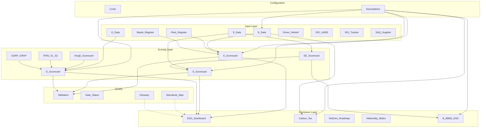

# Okiru ESG Intelligence Toolkit — Workbook Analysis

**Source of truth:** `docs/esg/Okiru_ESG_Toolkit_v1_7_SG_Consumer_LiveData.xlsx`  
**Extracted artifacts:** `docs/esg/extracted/*.json`, `docs/esg/screenshots/*.png`, `docs/esg/workbook_inventory.json`  
**Reference UI:** `docs/esg/okiru_esg_glass (2).html`  
**Analysis date:** June 2026  
**Client variant:** SG Consumer (SuperGroup SG Consumer Pty Ltd) — FMCG / Distribution sector template with live YTD data (Jul-25 → Mar-26, 9 months)

---

## Executive summary

The ESG toolkit is a **28-tab Excel workbook** organised in three logical layers:

| Layer | Sheets | Role |
|-------|--------|------|
| **Configuration** | Cover, Assumptions | Entity metadata, stance, sector variant, emission factors, thresholds, rating bands |
| **Input / registers** | E_Data, S_Data, G_Data, Fleet_Register, Waste_Register, Driver_Debrief, ISO_14083, ISO_Tracker, SAQ_Supplier | Monthly time-series, scalar governance fields, operational registers |
| **Scoring** | E_Scorecard, S_Scorecard, G_Scorecard, EE_Scorecard, King5_Scorecard | Weighted indicator scoring (108 + 100 + 100 pts per pillar, plus sub-scorecards) |
| **Aggregation / disclosure** | ESG_Dashboard, IFRS_S1_S2, GARP_GRAP, Materiality_Matrix, Carbon_Tax, NetZero_Roadmap, B_BBEE_ESG | Board KPIs, standards mapping, tax liability, B-BBEE bridge |
| **Quality / reference** | Validation, Data_Status, Audit_Log, Standards_Map, Glossary | Integrity checks, field completion tracker, audit trail, help text |

**Live snapshot scores (SG Consumer YTD):**

| Pillar | Score | Max | % |
|--------|-------|-----|---|
| Environmental | 36 | 108 | 33% |
| Social | 33 | 100 | 33% |
| Governance | 64.85 | 100 | 65% |
| **Overall ESG** | — | (see §4.6) | **44.6%** |

There are **no Excel named ranges** in this file; all references are direct cell/sheet formulas. **Assumptions** is the single configuration hub (stance floor, thresholds, EFs, rating bands).

---

## 1. Tab inventory (28 sheets)

| # | Sheet | Rows×Cols | Formulas | Validations | Purpose |
|---|-------|-----------|----------|-------------|---------|
| 1 | **Cover** | 42×4 | 0 | 0 | Entity info, navigation map, sheet index, version metadata |
| 2 | **Assumptions** | 112×6 | 2 | 6 | Stance, sector, standards, currency, carbon tax tier, emission factors, thresholds, rating bands, B-BBEE level table |
| 3 | **Audit_Log** | 30×6 | 0 | 0 | Change log (manual append) |
| 4 | **ESG_Dashboard** | 86×15 | 136 | 0 | Master dashboard — pillar scores, KPIs, net-zero position, executive summary |
| 5 | **E_Data** | 90×14 | 224 | 1 | Environmental inputs: monthly fleet/energy/water/waste/GHG by depot |
| 6 | **Fleet_Register** | 33×15 | 52 | 0 | Vehicle-level fuel norm tracking (Mix Telematics) |
| 7 | **ISO_14083** | 81×15 | 303 | 5 | ISO 14083 transport GHG methodology (well-to-wheel) |
| 8 | **Waste_Register** | 20×10 | 12 | 1 | Oricol/Cority waste diversion data |
| 9 | **Driver_Debrief** | 51×13 | 43 | 0 | Driver safety debrief scores (Apr-26) |
| 10 | **S_Data** | 82×12 | 71 | 0 | Social inputs: EE headcount grid, WSP/ATR, H&S, CSI, payroll |
| 11 | **G_Data** | 26×6 | 21 | 12 | Governance scalar inputs (board, King V, IFRS, ethics, POPIA) |
| 12 | **EE_Scorecard** | 25×9 | 82 | 6 | Employment Equity scoring (EEA2-style bands) |
| 13 | **E_Scorecard** | 30×9 | 55 | 0 | Environmental indicator scoring (108 pts max) |
| 14 | **S_Scorecard** | 28×9 | 54 | 0 | Social indicator scoring (84 pts max) |
| 15 | **G_Scorecard** | 26×9 | 43 | 0 | Governance indicator scoring (100 pts max) |
| 16 | **King5_Scorecard** | 22×9 | 38 | 17 | King V 17 principles Apply & Explain (170 pts internal) |
| 17 | **IFRS_S1_S2** | 30×8 | 24 | 22 | IFRS S1/S2 disclosure checklist (Yes/Partial/No) |
| 18 | **GARP_GRAP** | 30×11 | 40 | 18 | GARP ERM + GRAP public interest indicators |
| 19 | **ISO_Tracker** | 64×9 | 48 | 43 | ISO 14001/45001/27001/26000 certification tracker |
| 20 | **SAQ_Supplier** | 46×11 | 24 | 84 | Supplier assessment questionnaire (food safety / H&S) |
| 21 | **NetZero_Roadmap** | 27×13 | 50 | 0 | Decarbonisation pathway milestones vs SBTi |
| 22 | **B_BBEE_ESG** | 18×8 | 20 | 0 | Generic B-BBEE scorecard bridge from E/S/G data |
| 23 | **Materiality_Matrix** | 31×7 | 94 | 0 | Double materiality topic scoring |
| 24 | **Carbon_Tax** | 29×6 | 46 | 0 | SA carbon tax liability (Tier 1/2) |
| 25 | **Standards_Map** | 37×9 | 0 | 0 | Crosswalk: indicator → GRI/TCFD/IFRS/King V/ISO |
| 26 | **Glossary** | 101×5 | 0 | 0 | Term definitions and field help |
| 27 | **Validation** | 32×5 | 24 | 0 | Data completeness + GHG cross-check rules |
| 28 | **Data_Status** | 36×8 | 0 | 0 | Field-level completion tracker (manual status flags) |

**Screenshots:** All 28 tabs rendered to `docs/esg/screenshots/<sanitized-name>.png` via matplotlib text-grid (first 80 rows × 16 cols). These are **structural previews**, not pixel-perfect Excel exports — Excel COM was unavailable headless on this machine.

---

## 2. Entity model

### 2.1 Core entities (from Cover + Assumptions)

| Concept | Workbook location | Values (SG Consumer) |
|---------|-------------------|----------------------|
| **Company** | Cover C5 | SuperGroup SG Consumer (Pty) Ltd |
| **Reporting period** | Cover C6, E_Data headers | FY 2025/26 (Jul-25 → Jun-26); YTD = 9 months |
| **Sector variant** | Assumptions B8 (dropdown) | FMCG / Distribution (among 14 options) |
| **Standards pack** | Assumptions B9 | King V + IFRS S1/S2 |
| **Materiality approach** | Assumptions B10 | Single / Double / Dynamic |
| **Currency** | Assumptions B11 | ZAR |
| **Scoring stance** | Assumptions B6 | Lean / Standard / Strict |
| **Carbon tax basis** | Assumptions B13 | Current Tier 1 / Escalated Tier 2 / Both |
| **Baseline year (SBTi)** | Cover C10 | FY 2025/26 |
| **Net-zero target** | Cover C11 | 2050 (SBTi CNZS 2.0) |
| **Depots** | E_Data rows 14–18 | BLOEM, CPT, DBN, ISANDO, PE (5 depots) |

### 2.2 Time-series model

- **Periods:** Jul-25, Aug-25, … Mar-26 (9 columns: E_Data C13–K13)
- **Aggregation rules:**
  - **Sum:** fleet diesel, electricity, water, generator, LPG, fatalities, initiatives
  - **Average:** waste diversion %, cardboard recycling %, training hrs/employee, grant %, CSI %, board demographics, King V score
  - **Last non-null:** LTIFR, EV count
- **Prior period:** E_Data stores prior-year Scope 1+2 baseline (rows ~88–90) for YoY reduction scoring

### 2.3 Configuration object (Assumptions sheet)

All scorecards read thresholds and factors from Assumptions. Key groups:

**Emission factors (rows ~38–41):**

| Code | Value | Unit | Source |
|------|-------|------|--------|
| EF_DIESEL | 2.68 | kgCO₂e/L | DEFRA 2024 |
| EF_PETROL | 2.31 | kgCO₂e/L | DEFRA 2024 |
| EF_LPG | 1.51 | kgCO₂e/kg | DEFRA 2024 |
| EF_ELEC | 0.82 | kgCO₂e/kWh | Eskom NERSA 2024 |
| EF_SOLAR | 0.025 | kgCO₂e/kWh | Solar PV lifecycle |
| EF_WATER | 0.000344 | tCO₂e/kL | GHG Protocol Scope 3 |
| EF_LANDFILL | 0.58 | tCO₂e/tonne | Waste |

**Scoring stance (rows 8–9, primary controls block):**

| Control | Cell | Value (live) | Notes |
|---------|------|--------------|-------|
| Scoring stance | `B8` (label); edit cell per `F8` → **`B6`** (data validation) | Standard | Dropdown: Lean / Standard / Strict |
| Banding floor (auto) | **`B9`** | `0.5` | `=IF(B8="Lean",0.3,IF(B8="Strict",0.7,0.5))` — **all scorecards multiply targets by `Assumptions!$B$9` for partial credit** |

| Stance | Floor (`B9`) | Meaning |
|--------|--------------|---------|
| Lean | 30% | Partial credit below target but above floor |
| Standard | 50% | Default |
| Strict | 70% | Audit-grade |

**Not stance-related:** `B11` = Primary reporting standard (King V + IFRS S1/S2, GRI, etc.). `B_BBEE_ESG` partial-credit formulas also use `Assumptions!$B$9` as the banding floor — not the standards pack.

**Threshold registry (rows 43–60+, codes THR_*):**

| Code | Value | Used by |
|------|-------|---------|
| THR_GHG_YOY | 10% | E_Scorecard Scope 1 YoY reduction |
| THR_RE | 20% | Renewable electricity minimum |
| THR_FUEL_TOL | 1.05 | Fleet L/100km tolerance |
| THR_EV_MIN | (see sheet) | EV % minimum |
| THR_WASTE | 75% (`B48` = 0.75) | Waste diversion target (E_Scorecard row 19); `THR_WASTE_X` = 90% excellence benchmark (`B49`) |
| THR_BLACK | 60% | EE black employees |
| THR_BFM | 30% | Black female management |
| THR_PWD | 2% | Persons with disabilities |
| THR_TRAIN_HR | (see sheet) | Training hours/employee |
| THR_GRANT | (see sheet) | Mandatory grant recovery |
| THR_LTIFR | (see sheet) | LTIFR target (inverse scoring) |
| THR_CSI | 1% NPAT | CSI/SED spend |
| THR_LOCAL | (see sheet) | Local labour procurement |
| THR_SUP_HS | 60% | Supplier H&S compliance |
| THR_KING | 70% | King V Apply & Explain |
| THR_PI | 500 | GRAP public interest |
| THR_RISKS | 10 | Material ESG risks count |

**Rating bands (rows 62–65, used by ESG_Dashboard):**

| Band | Threshold | Label |
|------|-----------|-------|
| Excellent | ≥ Assumptions B62 | ★★★ Excellent |
| Good | ≥ B63 | ★★ Good |
| Adequate | ≥ B64 | ★ Adequate |
| Attention | < B64 | ⚠ Attention |

---

## 3. Input layers

### 3.1 E_Data — Environmental time-series hub

**Structure:**

1. **Emission factor reference block** (rows 4–10) — mirrors Assumptions; used inline for tCO₂e calculations
2. **Scope 1A — Fleet diesel by depot** (rows 12–19): 5 depots × 9 months + YTD + tCO₂e
3. **Scope 1B — Generators, LPG, business car** (rows ~20–35)
4. **Scope 2 — Grid electricity + solar** (rows ~40–55)
5. **Scope 3 — Water, waste** (rows ~58–75)
6. **GHG summary block** (rows ~80–90): Scope 1+2 totals, prior year, YoY delta
7. **Scalar environmental fields** (ISO 14001 status, policy, legal register, SBTi flag)

**Key editable cells:** Monthly columns C–K on data rows; scalar cells in column B/F for certification status.

**Validation:** 1 list validation on sheet (ISO 14001 status dropdown).

**Formula pattern:** `=SUM(C14:K14)` for YTD; `=L14*Assumptions!$B$38/1000` for tCO₂e (diesel).

### 3.2 S_Data — Social inputs

**Sections:**

- **Financial scalars:** Leviable payroll (B43), NPAT (B44) — required for WSP/SED calculations
- **EEA2-style headcount grid:** Race × gender × occupational level (rows ~12–40)
- **Monthly social metrics:** Training hrs, grant %, LTIFR, fatalities, CSI %, initiatives, local labour %, supplier H&S
- **WSP/ATR booleans:** Submitted flags
- **H&S programme flags:** Fatigue programme, incident logging

**EE_Scorecard** reads aggregated percentages from this sheet (e.g., black employee %, black female management %).

### 3.3 G_Data — Governance scalars + hidden score column

**Inputs:** columns **B** (values) and **D** (source notes). **Column F** holds **0–5 maturity scores** consumed directly by `G_Scorecard` (e.g. `G_Scorecard!C6 = G_Data!F13`, ethics `C22 = (F15+F16)/2×4/5`). This is **not** the Yes/Partial/No boolean model in `okiru_esg_backend.md`.

| Field | Input (B) | Score (F) | G_Scorecard use |
|-------|-----------|-----------|-----------------|
| Board total / black % / female % | numbers | F8–F11 banded vs `Assumptions!B50` | Indirect / board narrative |
| S&EC active | text/dropdown | F13 → 5 pts | Row 6 |
| ESG-linked remuneration | 0–5 | F14 | Row 7 |
| Code of ethics | 0–5 | list |
| Whistleblower hotline | 0–5 | list |
| Integrated report | 0–5 | list |
| External assurance | 0–5 | list |
| Material risks count | number | ≥ 0 |
| Legal register | 0–5 | list |
| Climate risk in ERM | 0–5 | list |
| POPIA IO status | Yes/Partial/No | list |
| Material penalties | number | ≥ 0 |
| IFRS disclosure fields | Yes/Partial/No | list (12 validations total) |

### 3.4 Operational registers

| Register | Input type | Feeds |
|----------|------------|-------|
| **Fleet_Register** | Per-vehicle L/100km vs norm | E_Scorecard fleet indicator; Validation |
| **Waste_Register** | Oricol diversion %, Cority cardboard % | E_Scorecard waste rows; ESG_Dashboard |
| **Driver_Debrief** | Monthly driver scores | S_Scorecard H&S (indirect) |
| **ISO_14083** | Transport leg emissions (WTW) | ISO reporting; cross-check E_Data |
| **ISO_Tracker** | Cert status per standard | G_Scorecard; ISO compliance KPIs |
| **SAQ_Supplier** | Supplier questionnaire (84 validations) | S_Scorecard supplier food safety |

### 3.5 Assumptions dropdowns (data validation → display row)

Excel validates **edit cells** in column B (rows 6–13); the “Active value” column in the control table (rows 8–15) mirrors them (`F8` = `Assumptions!B6`, etc.).

| Validation `sqref` | Control (row label) | Options |
|--------------------|---------------------|---------|
| **B6** | Scoring stance (`A8`) | Lean, Standard, Strict |
| **B8** | Sector (`A10`) | Generic, FMCG/Distribution, Transport/Logistics, … (14 sectors) — **locked to Transport/FMCG in this instance** |
| **B9** | Primary reporting standard (`A11`) | King V + IFRS S1/S2, GRI, ESRS, TCFD, Combined |
| **B10** | Materiality basis (`A12`) | Single, Double, Dynamic |
| **B11** | Reporting currency (`A13`) | ZAR, USD, EUR, … |
| **B13** | Carbon tax display (`A15`) | Current Tier 1, Escalated Tier 2, Both |

**B9 is not the standards dropdown in formulas** — scorecards reference **`Assumptions!$B$9` only as the computed banding floor** (row 9).

---

## 4. Calculation graph

### 4.1 Scoring primitives

The workbook implements three scoring patterns (documented in `okiru_esg_backend.md`, verified in formulas):

1. **Pro-rata (`pr`):** `ratio = actual/target`; full points if ratio ≥ 1; partial if ratio ≥ stance_floor; else 0
2. **Inverse pro-rata (`prI`):** For LTIFR — lower is better
3. **Binary (`bn`):** Yes = full, Partial = 50%, No = 0
4. **Existence check:** `IF(cell>0, maxPts, 0)` — used for baseline-established indicators
5. **MIN cap:** `=MIN(actual, maxPts)` on all scorecard D columns

**Status band (all scorecards F column):**

```
IF(score>=max, "✓ Met", IF(score>=max*0.5, "⚠ Partial", "✗ Gap"))
```

### 4.2 Environmental scorecard (E_Scorecard — 108 pts)

| # | Indicator | Max | Formula source | Key inputs |
|---|-----------|-----|----------------|------------|
| 1 | GHG Scope 1 baseline tracked | 5 | E_Data!L19>0 | Fleet diesel YTD |
| 2 | GHG Scope 1 YoY reduction | 10 | (baseline-current)/baseline vs THR_GHG_YOY | E_Data B90, F90 |
| 3 | GHG Scope 2 net reduction (solar) | 8 | Solar offset vs grid | E_Data solar kWh |
| 4 | GHG Scope 3 tracking | 5 | Existence flag | E_Data water/waste |
| 5 | Net-zero target (SBTi) | 5 | `Assumptions!B107` year 2030–2060 | Not `E_Data` boolean (HTML uses `D.sbti`) |
| Waste diversion ≥75% | 5 | `Waste_Register!B16` vs `THR_WASTE` (75%) | Partial credit via `B9` |
| Fleet L/100km within norm | 8 | `SUMPRODUCT` % vehicles within norm×`B45` | Partial fleet credit when register populated |
| ISO 14001 certification | 8 | **ISO_Tracker** (not E_Data alone) | Rows 26–29 |
| 6 | Energy kWh tracked monthly | 5 | COUNT months >0 | E_Data row 44 |
| 7 | Energy efficiency YoY | 5 | YoY comparison | E_Data |
| 8 | Fleet L/100km within norm | 8 | Fleet_Register | All vehicles |
| 9 | EV % of fleet | 5 | ev_count/fleet_total vs THR_EV | E_Data, scalar |
| 10 | Waste cardboard recycling | 4 | Waste_Register / E_Data avg | Cority data |
| 11 | Water tracked monthly | 4 | COUNT months >0 | E_Data row 61 |
| 12 | Water efficiency initiative | 3 | Scalar boolean | E_Data |
| 13 | ISO 14001 certified/in progress | 8 | Status dropdown | E_Data |
| 14 | Aspects register | 4 | Boolean | E_Data |
| 15 | Environmental policy | 4 | Yes/Partial/No | E_Data |
| 16 | NEMA/NWA/NEMWA compliance | 4 | Boolean | E_Data |

**Total:** `=SUM(D5:D20)` → D30 = **36** (live)

### 4.3 Social scorecard (S_Scorecard — 100 pts max)

| Section | Rows | Max pts | Live score (D col) | Primary sources |
|---------|------|---------|----------------------|-----------------|
| EE | 5–10 | 30 | 11 (plan/forum/targets at Partial; demographics 0) | **EE_Scorecard** `B5/B8`, **S_Data** L5/L6 headcount |
| WSP/ATR | 12–15 | 20 | 0 | **S_Data** B43–B49, L12 employees |
| H&S | 17–20 | 25 | 17 | **S_Data** G28–G35; **Driver_Debrief** C59 (fatigue); incident SUM G29:G33 |
| Community | 22–24 | 15 | 5 | **S_Data** CSI/NPAT; initiative COUNT A72:A79 |
| Supplier | 26–27 | 10 | 0 | **SAQ_Supplier** (manual; C/D often empty) |

**Total:** `D28` = **33** = `SUM(D5,D6,D7,D8,D9,D10,D12,…,D27)` (skips section header rows).

**LTIFR (row 17)** does **not** use the HTML `prI()` function. Workbook formula (when `S_Data!G35` is numeric):

```excel
IF(G35<=THR_LTIFR, 8, IF(G35<=THR_LTIFR/B9, MAX(0, 8*(1+B9-G35/THR_LTIFR)), 0))
```

Empty/zero LTIFR → **0 pts** (not “unpenalised null” as in `okiru_esg_backend.md`).

### 4.4 Governance scorecard (G_Scorecard — 100 pts)

| Section | Indicator | Max |
|---------|-----------|-----|
| King V | Score ≥70% | 25 |
| King V | S&EC established | 5 |
| King V | ESG-linked remuneration | 5 |
| IFRS | S1/S2 disclosures prepared | 10 |
| IFRS | Climate risk on board agenda | 5 |
| GARP | ERM includes ESG/climate | 8 |
| GRAP | Public interest compliance | 5 |
| ISO 27001 | POPIA IO appointed | 5 |
| ISO 27001 | Cyber/data risk assessed | 5 |
| Reporting | Integrated report published | 8 |
| Reporting | External assurance | 5 |
| Ethics | Code + hotline | 4 |
| Compliance | Legal register | 5 |
| Compliance | No material penalties | 5 |

**Total:** D26 = **64.85** (live). King V score derived from **King5_Scorecard!E21/170×25**.

### 4.5 Sub-scorecards

**EE_Scorecard (82 formulas):** EEA2 demographic bands vs EAP targets; feeds S_Scorecard EE rows and B_BBEE_ESG MC element.

**King5_Scorecard (38 formulas, 17 validations):** 17 King V principles × Apply/Explain/Material status; total /170 feeds G_Scorecard.

**IFRS_S1_S2 (24 formulas, 22 validations):** Disclosure checklist; `COUNTIF(...,"Yes")/total×points` pattern in G_Scorecard.

**GARP_GRAP (40 formulas):** ERM maturity + GRAP PI indicators.

### 4.6 Dashboard aggregation (ESG_Dashboard)

**Pillar display (% of each pillar’s own max):**

| Row | Score | Max | % (`D` col) |
|-----|-------|-----|-------------|
| Environmental | `E_Scorecard!D30` = 36 | 108 | 33.3% |
| Social | `S_Scorecard!D28` = 33 | 100 | 33.0% |
| Governance | `G_Scorecard!D26` = 64.85 | 100 | 64.9% |

**Overall ESG (`D9`) — equal average of “points ÷ 100” per pillar (not ÷108 for E):**

```excel
D9 = (E_Scorecard!D30/100 + S_Scorecard!D28/100 + G_Scorecard!D26/100) / 3
   = (36/100 + 33/100 + 64.8529/100) / 3 = 44.6%
```

Implications for web parity:

- Do **not** use raw `(E+S+G)/292` unless product explicitly changes the workbook formula.
- Environmental is **under-weighted** in the headline score vs its 108-pt cap (36/100 treats E as 36% of a 100-pt scale, not 36/108 ≈ 33.3%).
- `okiru_esg_glass (2).html` uses yet another model: `(eT/108×0.4 + sT/100×0.3 + gT/100×0.3)` — **three-way mismatch** (workbook vs HTML vs naive 292 sum).

Rating bands use `Assumptions!$B$62:$B$64` against **pillar %** (`D6`, `D7`, `D8`), not `D9`.

### 4.7 Carbon tax (Carbon_Tax)

Reads Scope 1+2 tCO₂e from E_Data; applies Assumptions carbon price tiers (B13 selection); calculates:
- Taxable emissions above free allowance
- Tier 1 current rate vs Tier 2 escalated
- Net liability after offsets

### 4.8 B-BBEE bridge (B_BBEE_ESG)

Maps ESG toolkit data to Generic Scorecard (Statement 000):

| Element | Weight | Auto-source |
|---------|--------|-------------|
| Ownership | 25 | Manual (D6) |
| Management Control | 19 | EE_Scorecard!E15/100 × 19 |
| Skills Development | 25 | S_Data training spend / payroll |
| ESD | 40 | Manual (D9) |
| SED | 5 | CSI/NPAT vs THR_CSI |
| Bonus | 5 | Manual |

Level determination uses Assumptions B76–B83 threshold table.

### 4.9 Validation sheet rules

| Check | Formula |
|-------|---------|
| Fleet diesel 9 months | COUNTIF(E_Data!C14:K14,">0")=9 |
| Electricity 9 months | COUNTIF(E_Data!C44:K44,">0")=9 |
| Water 9 months | COUNTIF(E_Data!C61:K61,">0")=9 |
| EE headcount >0 | S_Data!L12>0 |
| E/S/G scorecard totals >0 | E_Scorecard!D30, etc. |
| King5 17 principles filled | COUNTA(King5!C4:C30)=17 |
| IFRS disclosures entered | COUNTA(IFRS!D4:D40)>0 |
| Fleet register populated | COUNTA(Fleet_Register!A4:A30)>0 |
| Waste data loaded | Waste_Register!D5>0 |
| Driver debrief loaded | COUNTA(Driver_Debrief!C4:C15)>0 |

Plus manual GHG verification block (rows 19–32) with expected tCO₂e per depot for audit cross-check.

---

## 5. Link matrix (input → calculation → output)

| Input sheet / field | Intermediate | Output consumer |
|---------------------|--------------|-----------------|
| E_Data fleet diesel (C14:K14) | tCO₂e calc (L×EF) | E_Scorecard rows 5–6; ESG_Dashboard GHG KPIs; Carbon_Tax; Validation |
| E_Data electricity (C44:K44) | Scope 2 tCO₂e | E_Scorecard row 7; Carbon_Tax; Validation |
| E_Data solar kWh | Grid offset | E_Scorecard row 7 |
| E_Data water/waste | Scope 3 | E_Scorecard rows 10–12 |
| E_Data SBTi/ISO flags | Binary scores | E_Scorecard rows 5, 13–16 |
| Fleet_Register L/100km | Norm comparison | E_Scorecard row 8 |
| Waste_Register diversion % | Average | E_Scorecard row 10; ESG_Dashboard |
| S_Data headcount grid | EE % calcs | EE_Scorecard → S_Scorecard → B_BBEE_ESG MC |
| S_Data payroll/NPAT | Ratio denominators | S_Scorecard CSI; B_BBEE_ESG SD/Skills |
| S_Data WSP/ATR flags | Binary | S_Scorecard rows 7–8 |
| S_Data LTIFR/fatalities | Inverse/sum | S_Scorecard H&S |
| G_Data board/ethics fields | Scaled 0–5 | G_Scorecard rows 6–7, 19–25 |
| King5_Scorecard E21 total | /170×25 | G_Scorecard row 5 |
| IFRS_S1_S2 Yes count | Proportion×10 | G_Scorecard row 9 |
| GARP_GRAP indicators | Conditional 0/4/8 | G_Scorecard row 12 |
| Assumptions thresholds | All scorecards | Rating bands, partial credit floors |
| Assumptions EF_* | E_Data tCO₂e | All GHG totals |
| EE_Scorecard E15 | % score | B_BBEE_ESG MC element |
| E/S/G_Scorecard totals | SUM | ESG_Dashboard overall % |
| Carbon_Tax net liability | Tier calc | ESG_Dashboard executive summary |
| Materiality_Matrix scores | Topic weights | IFRS/GRI disclosure priority |
| NetZero_Roadmap milestones | Gap analysis | ESG_Dashboard net-zero section |
| Standards_Map | Static reference | Glossary cross-links |

---

## 6. Hint / guidance mapping

| Help source | Maps to |
|-------------|---------|
| **Glossary** (101 rows) | Field codes (THR_*, EF_*), standards acronyms, depot names |
| **Standards_Map** (37 rows) | Each scorecard indicator → GRI/TCFD/IFRS/King V/ISO clause |
| **Scorecard column I ("Audit / Calculation")** | Per-indicator formula explanation (e.g., E_Scorecard I5: "E_Data!L19 > 0 → full 5 pts") |
| **Cover navigation section** | Sheet index with layer labels (Input / Score / Disclose) |
| **Assumptions column F ("Rationale")** | Threshold business justification |
| **Validation column E ("Action")** | Remediation hint when check fails |
| **Data_Status** | Per-field completion status (Complete / Partial / Missing / N/A) |
| **okiru_esg_input_layer.md** | Paste engine row-label dictionary (for web Data Import tab) |
| **okiru_esg_frontend.md** | Page inventory mapping to workbook sheets |

---

## 7. Parity mapping to B-BBEE monorepo patterns

| ESG concept | B-BBEE analogue | Monorepo path |
|-------------|-----------------|---------------|
| Workbook tabs | Information Request sections | `apps/web/src/components/workbook/sections.ts` |
| Grey = required input | Same convention | `sections.ts` header comment; `bbbeeInfoRequestRules.json` |
| Section grid + meta | company-information, financial-information | `SectionWorkbookEditor`, `FormModeGrid` |
| Row validation | `rowValidate` cross-field | `workbookValidation.ts` |
| Cell popup hints | `validationMessage`, `guidance` | `CellValidationPopup.tsx` |
| Sector variant | FSC sub-sector (Banks/LTI/STI) | `sectorConfig.ts`, `fsc-utils.ts`, `fsc-banks.ts` |
| Sector config / calculators | `CalculatorConfig` per sector | `apps/web/Toolkit/src/lib/sectors/*.ts` |
| Golden tests | fsc-banks-golden.test.ts | `apps/web/Toolkit/src/lib/calculators/__tests__/` |
| Client entity | Client + pillars in Zustand | `apps/web/Toolkit/src/lib/store.ts` |
| Workbook persistence | MongoDB WorkbookModel | `apps/web/server/workbookRoutes.ts`, `shared/schema.ts` |
| Company save flow | create-scorecard → workbook → toolkit | `InformationRequest.tsx` → `WorkbookScoreSummary.tsx` → `/toolkit` |
| Hub toolkit list | Active vs coming-soon | `apps/web/src/pages/HubLanding.tsx` (ESG uses `handleComingSoon`) |
| Toolkit routing | Nested `/toolkit/*` | `apps/web/src/App.tsx` → `ToolkitView` → `apps/web/Toolkit/src/App.tsx` |
| Client picker | ClientSelector | `apps/web/Toolkit/src/pages/ClientSelector.tsx` |
| Sidebar navigation | Pillar nav with scores | `apps/web/Toolkit/src/components/layout/Sidebar.tsx` |
| Pipeline ingestion | Excel template → graph | `apps/api/arango/ingestion/templateIngester.ts` (BBBEE only today) |
| Scorecard API | `/api/scorecard` | `apps/api/src/routes/scorecard.ts` |

### Recommended ESG mapping

| ESG layer | Implement as |
|-----------|--------------|
| Assumptions | `esgConfig.ts` sector variant (like `fsc-banks.ts`) + org-level settings |
| E_Data / S_Data / G_Data | Workbook sections with monthly grid columns (like employees grid) |
| Registers (Fleet, Waste, etc.) | Additional workbook sections with row validators |
| Scorecards | Calculator modules: `esg-environmental.ts`, `esg-social.ts`, `esg-governance.ts` |
| ESG_Dashboard | New `EsgDashboard.tsx` (like `Scorecard.tsx` + `ScorecardSummary.tsx`) |
| Validation | Extend `workbookValidation.ts` pattern → `esgValidation.ts` |
| Standards_Map / Glossary | Static JSON config served to UI tooltips |

---

## 8. Gaps, ambiguities, open questions

### 8.1 Workbook-internal ambiguities

1. **Overall score denominator:** `ESG_Dashboard!D9` divides **E by 100** while E max is **108** — headline overall ≠ average of pillar % in column D.
2. **Stance edit cell:** Data validation on `B6`, display label on row 8 `B8`; banding floor always `B9`.
3. **Cover version mismatch:** Cover says v1.6; instance metadata says v1.7.
4. **Scorecard titles vs totals:** Sheet headers say “vs 100 pts” but E sums to **108**; S and G sum to **100**.
5. **ISO_14083 vs E_Data:** Parallel WTW transport model (303 formulas); **not** cross-checked in `Validation` GHG block (fleet diesel only).
6. **SAQ_Supplier → S_Scorecard:** Rows 26–27 read SAQ but live `C26/C27` = 0 — supplier section scores zero despite 84 validations.
7. **King5 completeness:** `Validation!C12` = 7 of 17 principles with status — fails “all principles filled” check.
8. **EE headcount gate:** `Validation!C8` = No (`S_Data!L12` = 0) while EE plan/forum rows still award partial points on `S_Scorecard`.
9. **No named ranges / no hidden sheets:** 28 visible tabs only; all refs are literal addresses (port via column I audit text).
10. **B_BBEE_ESG totals:** Banner says 109+5 bonus; `B12` sums weights **119** (25+19+25+40+5+5).
11. **Sector instance lock:** Assumptions row 3–4 state **do not change sector dropdown** — template is a fork, not runtime multi-sector.

### 8.2 Product / integration gaps

1. **No multi-tenant sector templates yet** — only SG Consumer live data; other Assumptions B8 sectors untested.
2. **B-BBEE bridge is one-way** — ESG reads EE data but doesn't write back to existing BBBEE toolkit store.
3. **Prior period panel** (HTML reference) has no workbook sheet — lives only in glass HTML prototype.
4. **Carbon credits register (`CR`)** documented in backend.md but no dedicated workbook tab in v1.7.
5. **Audit_Log** is manual — no auto-logging on cell change (unlike web workbook versioning).

### 8.3 Unanswered review questions

- Confirm whether **ESG_Dashboard `D9` formula** (÷100 per pillar) is intentional or should be fixed to ÷108/÷100/÷100 before web parity.
- Are ISO_14083 WTW emissions **additive** to E_Data or **alternative methodology**?
- Should web **LTIFR** follow workbook (0 when blank) or HTML/backend (null = unpenalised)?
- Is **G_Data column F** the canonical governance input for scoring (0–5), replacing boolean fields in the HTML prototype?
- Which indicators are **sector-conditional** (FMCG vs Transport) beyond Assumptions thresholds?
- Is **EE_Scorecard** in scope for v1 web UI or folded into S_Data grid only?
- Should **King5_Scorecard** be a separate nav item or sub-page of Governance?
- What is the **submit/sign-off** workflow equivalent to workbook `submittedAt` in B-BBEE?

---

## 9. Workbook processing artifacts

| Artifact | Location | Notes |
|----------|----------|-------|
| Sheet inventory | `docs/esg/workbook_inventory.json` | 28 sheets, formula/validation counts |
| Per-sheet JSON | `docs/esg/extracted/<Sheet>.json` | Up to 200 rows × 40 cols, formulas inline |
| Per-sheet MD summary | `docs/esg/extracted/<Sheet>.md` | First 30 rows + validation summary |
| Screenshots | `docs/esg/screenshots/<Sheet>.png` | Matplotlib renders (28/28 success) |
| Extraction script | `docs/esg/extract_esg_workbook.py` | Re-runnable |

---

## 10. Architecture diagram



---

## Adversarial review (pass 2)

**Reviewer:** Independent pass over extracted JSON, `okiru_esg_glass (2).html`, `okiru_esg_*.md`, and B-BBEE patterns (`sections.ts`, `workbookValidation.ts`, FSC golden tests).  
**Date:** June 2026

### Corrections applied inline (pass 1 gaps)

| # | Finding | Fix location |
|---|---------|--------------|
| 1 | Social live score **33/100**, not 24/84 | Executive summary, §4.3 |
| 2 | Overall = **average of pillar_pts÷100**, not ÷292 | §4.6 |
| 3 | `Assumptions!$B$9` = **banding floor**, not standards pack | §2.3, §3.5, §8.1 |
| 4 | `THR_WASTE` = **75%** (0.75), not 90% | §2.3, §4.2 |
| 5 | `G_Data!F*` **0–5 scores** drive `G_Scorecard` | §3.3 |
| 6 | SBTi row uses **`Assumptions!B107`**, not E_Data flag | §4.2 link table |
| 7 | Fleet L/100km **SUMPRODUCT** partial credit | §4.2 |
| 8 | LTIFR workbook formula ≠ HTML `prI()` | §4.3 |
| 9 | Assumptions dropdown map (B6/B8/B11 vs conflated B9) | §3.5 |

### Additional issues (documented; not all inline)

| Severity | Issue | Evidence |
|----------|-------|----------|
| **Blocker** | Three overall-score models (workbook `D9`, HTML 40/30/30, naive 292) | `ESG_Dashboard!D9`; HTML `calcAll` overall |
| **Blocker** | HTML `okiru_esg_backend.md` booleans vs workbook **G_Data F** 0–5 | `G_Scorecard` C6,C22,C19 |
| **High** | `EE_Scorecard` required for S pillar; empty headcount still allows partial EE rows | `S_Scorecard` D7,D9,D10 > 0; `Validation` C8 = No |
| **High** | `ISO_Tracker` + `Waste_Register` + `Fleet_Register` are score **gates**, not optional registers | `E_Scorecard` rows 15–17, 19–21, 26–29 |
| **High** | `ISO_14083` (303 formulas) not in Validation GHG cross-check | `Validation` rows 19–32 |
| **Medium** | `King5_Scorecard` only **7/17** principles with status | `Validation!C12` |
| **Medium** | `Materiality_Matrix` does not feed scorecards (disclosure priority only) | No refs from E/S/G scorecards in extracted formulas |
| **Medium** | `Driver_Debrief!C59>0` gates fatigue points, not `S_Data` boolean | `S_Scorecard` C19 |
| **Medium** | Carbon credits (`CR`) exist in HTML only — no workbook tab | `workbook_inventory.json` |
| **Low** | No Excel hidden sheets or defined names | `defined_names: []`, 28 visible tabs |
| **Low** | `Audit_Log` / `Data_Status` do not gate scoring | Manual append / status flags |

### B-BBEE monorepo cross-check

| ESG need | Must mirror B-BBEE pattern | Gap |
|----------|---------------------------|-----|
| Section defs + grey=required | `sections.ts` + `bbbeeInfoRequestRules.json` | Need `esgSections.ts` + rules JSON with **monthly grid** + **meta 0–5** fields |
| `rowValidate` cross-field | `workbookValidation.ts` | EE L12 vs band totals; NPAT before CSI; payroll before Skills bridge |
| Sector variant | `sectorConfig.ts` / `fsc-banks.ts` | ESG instance is **forked template**, not live B8 switch — use `esgConfig/consumer-goods.ts` not dropdown alone |
| Golden snapshot | `fsc-banks-golden.test.ts` | Fixture must use **workbook** formulas (33/36/64.85), not HTML |
| Submit gate | `WorkbookScoreSummary` + `submittedAt` | Map `Validation` sheet + King5 17/17 rule |

### Score parity checklist (SG Consumer live)

```
E_Scorecard!D30     = 36    (max 108)
S_Scorecard!D28     = 33    (max 100)
G_Scorecard!D26     = 64.8529411765 (max 100)
ESG_Dashboard!D9    = 44.6176470588% (= (36+33+64.8529)/300 )
```

---

*End of analysis. See `ESG_IMPLEMENTATION_PLAN.md` for monorepo integration roadmap. Open blockers: `ESG_OPEN_QUESTIONS.md`.*
