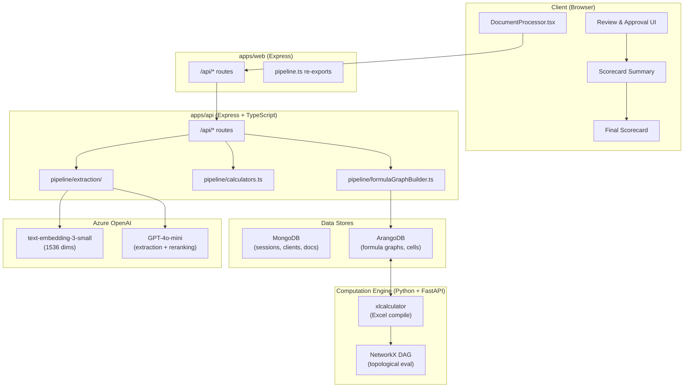
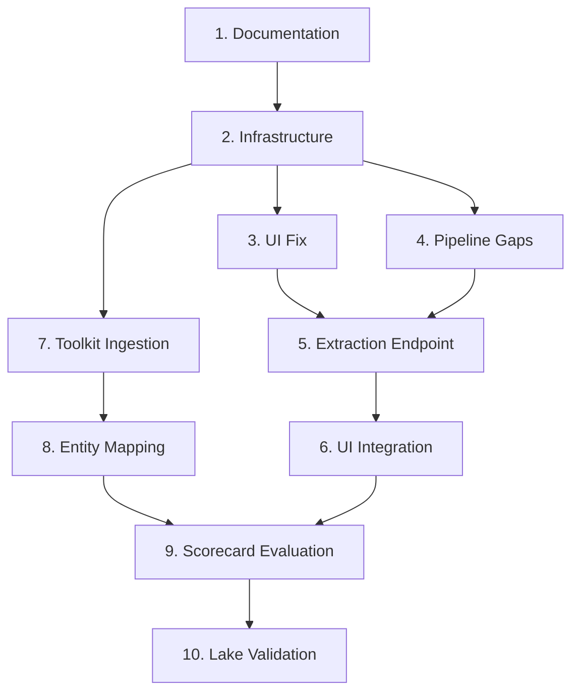

# B-BBEE Scorecard Platform - Implementation Summary

## 1. System Architecture

### High-Level Flow



### Component Responsibilities

| Component | Technology | Responsibility |
|-----------|------------|----------------|
| DocumentProcessor.tsx | React + TypeScript | Wizard UI: company info → upload → review → summary → scorecard |
| apps/web | Express | Serves UI, proxies API calls, re-exports pipeline |
| apps/api | Express + TypeScript | Core API: extraction, calculation, ArangoDB integration |
| ArangoDB | ArangoDB 3.x | Formula graphs, cell dependencies, toolkit models |
| Computation Engine | Python + FastAPI | Excel compilation, topological evaluation |
| Azure OpenAI | OpenAI SDK | Embeddings + GPT-4o-mini extraction |
| MongoDB | Mongoose | User sessions, processor sessions, clients, documents |

---

## 2. Data Flow

### 2.1 Document Upload to Extraction

```
User uploads file (PDF/CSV/XLSX/TXT/DOCX)
    ↓
POST /api/extract-entities-hybrid
    ↓
1. Parse to text pages:
   - CSV/XLSX: xlsx library → row/page objects
   - PDF: pdfjs-dist → text pages
   - TXT: direct
   - DOCX: unzip + XML parsing
    ↓
2. Chunk pages:
   documentChunker.buildChunks(pages)
   → DocumentChunk[] with chunk_id, text, metadata
    ↓
3. Build indexes:
   - bm25Index.build(chunks) → BM25Okapi
   - entityIndex.build(chunks) → entity → pageId map
   - embeddingStore.index(chunks) → chunk_id → embedding[]
    ↓
4. Load entity manifest:
   buildManifestForSector(sectorCode, scorecardType)
   → EntityManifest with requiredEntities[]
    ↓
5. Per entity extraction:
   For each EntityRequirement:
     a. Build search query from definition + aliases
     b. Embed query → embeddingStore.search()
     c. BM25 search + entityIndex search
     d. hybridRetriever.fuse(bm25, semantic, entity)
     e. LLM rerank top-5 candidates (GPT-4o-mini)
     f. llmExtractor.extract(topChunk, entityDef)
     g. structuralVerify(value, sourceText)
     h. validator.validate(value, rules)
     i. confidenceScorer.compute(retrievalScore, verify, validate)
    ↓
6. Return ExtractionResult[]:
   { name, value, confidence, status, pillar, provenance }
```

### 2.2 Review to Scorecard

```
User reviews entities in UI
    ↓
Inline edit / approve / reject each entity
    ↓
100% approval required → Proceed to Summary
    ↓
Map approved entities → cell addresses:
   entityToCellMapping[sectorCode][scorecardType][entityName]
   → "'1. General Information'!B5"
    ↓
POST /api/scorecard/evaluate-by-sector
   { sectorCode, scorecardType, overrides: { cellAddress: value } }
    ↓
ArangoDB: lookup sector_model_mappings
   → modelVersionId
    ↓
Computation Engine: load model artifact
   → cells[] + graph{nodes, edges}
    ↓
Topological evaluation:
   - Initialize state: overrides first, then stored values
   - For each formula cell in dependency order:
     evaluateFormula(formulaString, currentState)
   - Store all computed values
    ↓
Return full scorecard:
   { pillars[], totalPoints, beeLevel, recognition%, subMinimums[] }
    ↓
Display Summary → Final Scorecard
```

---

## 3. API Contracts

### 3.1 Extraction Endpoints

#### POST /api/extract-entities-hybrid

**Request**: `multipart/form-data`
```typescript
{
  file: File,                    // Required: PDF/CSV/XLSX/TXT/DOCX
  sectorCode: string,            // Required: "RCOGP" | "ICT" | "FSC" | "AGRI"
  scorecardType: string,         // Required: "Generic" | "QSE"
  entityTemplateId?: string      // Optional: MongoDB template ID
}
```

**Response**: `200 OK`
```typescript
{
  success: true,
  entities: [
    {
      name: string,               // e.g., "TotalRevenue"
      value: string | number,     // Extracted value
      confidence: number,         // 0.0 - 1.0
      status: "pending" | "approved" | "rejected",
      pillar: string,             // e.g., "ownership"
      fieldType: "currency" | "percentage" | "count" | "string" | "date" | "bee_level",
      definition: string,         // Full entity definition
      provenance: {
        pageId: string,
        chunkId: string,
        textSnippet: string,
        retrievalScore: number
      }
    }
  ],
  timing: {
    parse: number,                // ms
    chunk: number,
    index: number,
    extract: number,
    total: number
  }
}
```

### 3.2 Scorecard Endpoints

#### POST /api/scorecard/evaluate-by-sector

**Request**: `application/json`
```typescript
{
  sectorCode: string,            // "RCOGP" | "ICT" | "FSC" | "AGRI"
  scorecardType: string,         // "Generic" | "QSE"
  overrides: {                   // Cell address → value
    [cellAddress: string]: number | string
  },
  clientId?: string,
  measurementPeriod?: string
}
```

**Response**: `200 OK`
```typescript
{
  success: true,
  sectorCode: string,
  scorecardType: string,
  pillars: {
    ownership: {
      score: number,
      maxPoints: number,
      percentage: number,
      subMinimumMet: boolean
    },
    managementControl: { ... },
    employmentEquity: { ... },
    skillsDevelopment: { ... },
    preferentialProcurement: { ... },
    enterpriseSupplierDevelopment: { ... },
    socioEconomicDevelopment: { ... },
    yesInitiative: { ... }
  },
  totalPoints: number,
  maxPossiblePoints: number,
  beeLevel: number,              // 1-8 or 0
  recognitionPercentage: number, // e.g., 135 for Level 1
  subMinimums: {
    ownership: boolean,
    skillsDevelopment: boolean,
    preferentialProcurement: boolean
  },
  isNonCompliant: boolean,
  cells: {                       // All computed cell values
    [cellAddress: string]: number | string
  }
}
```

### 3.3 Template Ingestion Endpoints

#### POST /api/templates/ingest

**Request**: `multipart/form-data`
```typescript
{
  file: File,                    // Excel toolkit template (.xlsx)
  name?: string,                 // Human-readable name
  sectorCode?: string,           // Override auto-detect
  scorecardType?: string         // Override auto-detect
}
```

**Response**: `201 Created`
```typescript
{
  success: true,
  graphId: string,               // ArangoDB formula_graphs._key
  computeModelId?: string,       // Computation Engine version_id
  cellsIngested: number,
  dependenciesIngested: number,
  scorecard: {
    sectorCode: string,
    scorecardType: string,
    pillars: string[],
    maxPoints: number
  }
}
```

### 3.4 Entity Templates CRUD

#### GET /api/entity-templates

**Response**: `200 OK`
```typescript
{
  templates: [
    {
      id: string,
      name: string,
      description: string,
      version: string,
      sectorCode: string,
      scorecardType: string,
      entityCount: number,
      createdAt: string,
      updatedAt: string
    }
  ]
}
```

#### POST /api/entity-templates

**Request**: `application/json`
```typescript
{
  name: string,
  description?: string,
  version?: string,              // default "1.0"
  sectorCode: string,
  scorecardType: string,
  entities: EntityRequirement[]
}
```

---

## 4. Database Schemas

### 4.1 MongoDB Collections

#### EntityTemplate (entity_templates)

```typescript
interface EntityTemplateDocument {
  _id: ObjectId;
  id: string;                    // UUID
  name: string;
  description: string;
  version: string;
  sectorCode: string;            // "RCOGP" | "ICT" | "FSC" | "AGRI"
  scorecardType: string;         // "Generic" | "QSE"
  entities: EntityRequirement[];
  sheetHints: SheetHint[];
  isDefault: boolean;
  createdAt: Date;
  updatedAt: Date;
}
```

#### ProcessorSession (processor_sessions)

```typescript
interface ProcessorSessionDocument {
  _id: ObjectId;
  sessionId: string;             // Unique session ID
  companyInfo: {
    name: string;
    sector: string;              // Selected sector code
    registrationNumber?: string;
    annualTurnover: string;
    employees?: string;
    financialYearEnd?: string;
    // ... other fields
  };
  currentStep: 'company-info' | 'upload' | 'classify' | 'extract' | 'review' | 'summary' | 'scorecard';
  filesData: UploadedFile[];
  extractionResults: ExtractionResult[];
  fileClassifications: Record<string, number>; // fileId -> templateId
  isComplete: boolean;
  scorecardResult?: ScorecardResult;
  createdAt: Date;
  updatedAt: Date;
  createdByUserId: string;
}
```

### 4.2 ArangoDB Collections

#### Document Collections (16 total)

| Collection | Purpose | Key Pattern |
|------------|---------|-------------|
| `formula_graphs` | Excel workbook as DAG | `{graphKey}` |
| `cells` | Individual cells | `{graphKey}_{sheet}_{col}{row}` |
| `scorecard_models` | Computation Engine artifacts | `{version_id}` |
| `scorecard_snapshots` | Evaluation results | `{timestamp}_{version_id}` |
| `companies` | Active model per company | `{company_id}` |
| `sector_model_mappings` | sector+type → model | `{sectorCode}_{scorecardType}` |
| `toolkit_files` | Raw Excel base64 | `{sectorCode}_{scorecardType}` |
| `audit_entries` | Change log | `{timestamp}_{action}` |
| `scorecards` | Scorecard structure | `{sectorCode}_{scorecardType}` |
| `pillars` | Pillar definitions | `{scorecard_id}_{pillarCode}` |
| `indicators` | Scoring indicators | `{pillar_id}_{indicatorCode}` |
| `compliance_targets` | Target thresholds | `{indicator_id}_target` |
| `entity_manifests` | Extraction entities | `{template_id}` |
| `cell_values` | Cached cell values | `{graphKey}_{address}` |
| `calculation_results` | Computed results | `{session_id}` |
| `overrides` | User overrides | `{session_id}_{cell}` |

#### Edge Collections (7 total)

| Collection | From | To | Purpose |
|------------|------|-----|---------|
| `pillar_of` | pillars | scorecards | Pillar belongs to scorecard |
| `depends_on` | cells | cells | Cell formula dependencies |
| `derived_from` | indicators | indicators | Indicator derivation |
| `scored_under` | assessments | scorecards | Assessment uses scorecard |
| `sector_applies` | scorecards | sectors | Scorecard for sector |
| `indicator_of` | indicators | pillars | Indicator in pillar |
| `cell_dependency` | cells | cells | Explicit dependency edges |

---

## 5. Component Inventory

### 5.1 Extraction Pipeline (apps/api/pipeline/extraction/)

| File | Lines | Status | Role |
|------|-------|--------|------|
| `bm25Index.ts` | ~150 | Done | BM25Okapi indexing and search |
| `documentChunker.ts` | ~200 | Done | Hierarchical chunking (ported from audit-ai) |
| `entityIndex.ts` | ~180 | Done | Entity NER index over document |
| `hybridRetriever.ts` | ~220 | Done | Weighted fusion BM25 + semantic + entity |
| `nerEngine.ts` | ~200 | Done | Rule-based NER (ORG, MONEY, DATE, etc.) |
| `entityManifest.ts` | ~900 | Done | All 6 template entity definitions |
| `llmExtractor.ts` | ~300 | **Update** | LLM extraction (needs Azure OpenAI) |
| `confidenceScorer.ts` | ~150 | Done | Confidence scoring 0-10 |
| `validator.ts` | ~180 | Done | Entity validation rules |
| `provenanceTracker.ts` | ~120 | Done | Audit trail tracking |
| `index.ts` | ~50 | Done | Barrel exports |
| `azureOpenAIClient.ts` | **New** | **Add** | Azure OpenAI client for embeddings + chat |
| `embeddingStore.ts` | **New** | **Add** | In-memory vector store with cosine similarity |

### 5.2 Calculation Pipeline (apps/api/pipeline/)

| File | Lines | Role |
|------|-------|------|
| `sectorConfig.ts` | ~470 | Sector configurations (6 templates) |
| `sectorCalculators.ts` | ~400 | TypeScript calculator implementations |
| `calculators.ts` | ~300 | Generic calculator baseline |
| `buildResult.ts` | ~350 | Orchestrates calculation from ParseResult |
| `levelDetermination.ts` | ~80 | BEE level from points |
| `formulaGraphBuilder.ts` | ~600 | Excel → formula DAG with semantic tags |
| `computeClient.ts` | ~200 | HTTP client to Computation Engine |

### 5.3 API Routes (apps/api/src/routes/)

| File | Endpoints | Role |
|------|-----------|------|
| `entityTemplates.ts` | CRUD /api/entity-templates | Entity template management |
| `extractAndScore.ts` | POST /api/extract-and-score | Legacy extraction + scoring |
| `scorecard.ts` | /api/scorecard/* | Scorecard evaluation proxy |
| `templates.ts` | /api/templates/* | Toolkit ingestion + evaluation |
| `accuracy.ts` | /api/accuracy/* | Validation and graph analysis |
| `hybridExtraction.ts` | **New** POST /api/extract-entities-hybrid | Full hybrid RAG extraction |

---

## 6. Sector/Template Mapping

### 6.1 Complete Template Matrix

| Sector | Scorecard Type | Code | Max Points | Templates | QSE Threshold |
|--------|---------------|------|------------|-----------|---------------|
| RCOGP | Generic | `RCOGP_GENERIC` | 116 | RCOGP Generic Scorecard | >R50M |
| RCOGP | QSE | `RCOGP_QSE` | 100 | RCOGP QSE | R10M-R50M |
| ICT | Generic | `ICT_GENERIC` | 109 | ICT Generic Scorecard | >R50M |
| ICT | QSE | `ICT_QSE` | 100 | ICT QSE Scorecard | R10M-R50M |
| FSC | Generic | `FSC_GENERIC` | varies | FSC Generic | N/A |
| AGRI | Generic | `AGRI_GENERIC` | varies | AGRI Generic | N/A |

### 6.2 Pillar Configuration by Template

#### RCOGP Generic

| Pillar | Max Points | Sub-Minimum | Threshold |
|--------|------------|-------------|-----------|
| Ownership | 25 | Yes | 40% of net value |
| Management Control | 8 | No | - |
| Employment Equity | 11 | No | - |
| Skills Development | 25 | Yes | 40% of overall |
| Preferential Procurement | 27 | Yes | 40% of base |
| ESD | 15 | No | - |
| SED | 5 | No | - |

#### ICT Generic

| Pillar | Max Points | Notes |
|--------|------------|-------|
| Ownership | 25 | Same as RCOGP |
| Management Control | 8 | Same |
| Employment Equity | 11 | Same |
| Skills Development | 25 | Same |
| Preferential Procurement | 25 | Lower than RCOGP |
| ESD | 10 | Lower than RCOGP |
| SED | 5 | Same |

#### RCOGP QSE

| Pillar | Max Points | Notes |
|--------|------------|-------|
| Ownership | 25 | Same |
| Management Control | 19 | MC + EE combined |
| Employment Equity | 0 | Merged into MC |
| Skills Development | 25 | Same |
| Preferential Procurement | 25 | Lower |
| ESD | 15 | Higher relative weight |
| SED | 5 | Same |

---

## 7. Computation Engine Flow

### 7.1 Excel Compilation

```
Excel Toolkit Template (.xlsx)
    ↓
POST /api/templates/ingest
    ↓
XLSX.read(buffer, { cellFormula: true })
    ↓
For each cell in selected sheets:
  - Extract formula string
  - Extract dependencies via regex
  - Normalize address: "Sheet!A1"
  - Tag semantically (pillar, role)
    ↓
Build FormulaGraph:
  nodes: cells[]
  edges: dependencies[] (from → to)
  inputs: cells without formulas
  outputs: cells with formulas
    ↓
Store in ArangoDB:
  - formula_graphs document
  - cells documents (one per cell)
  - cell_dependency edges
    ↓
POST to Computation Engine /admin/models/upload
    ↓
xlcalculator.ModelCompiler.compile()
    ↓
Topological sort via NetworkX
    ↓
Store model_artifact in ArangoDB scorecard_models
    ↓
Create sector_model_mappings entry
```

### 7.2 Formula Evaluation

```
POST /api/scorecard/evaluate-by-sector
    ↓
Lookup sector_model_mappings
    ↓
Load model_artifact from scorecard_models
    ↓
Initialize state:
  - Apply overrides first (user inputs)
  - Load stored values for non-formula cells
  - Formula cells start as null
    ↓
Topological order evaluation:
  For each formula cell in dependency order:
    - Substitute cell refs from state
    - Handle functions: SUM, AVERAGE, IF, MAX, MIN
    - eval() with restricted namespace
    - Store result in state
    ↓
Collect all computed values
    ↓
Map pillar cells to pillar scores
    ↓
Determine sub-minimums from config
    ↓
Calculate total points, level, recognition
    ↓
Return full scorecard
```

---

## 8. Configuration

### 8.1 Environment Variables

#### apps/api (.env)

```bash
# Server
PORT=5000
NODE_ENV=development

# MongoDB
MONGODB_URI=mongodb://localhost:27017/okiru

# ArangoDB
ARANGO_URL=http://127.0.0.1:8529
ARANGO_DB=bbbee_db
ARANGO_USER=root
ARANGO_PASSWORD=Okiru123!

# Azure OpenAI
AZURE_OPENAI_ENDPOINT=https://your-resource.openai.azure.com
AZURE_OPENAI_API_KEY=your-api-key
AZURE_OPENAI_DEPLOYMENT=gpt-4o-mini
AZURE_OPENAI_EMBEDDING_DEPLOYMENT=text-embedding-3-small
AZURE_OPENAI_API_VERSION=2024-02-15-preview

# Groq (fallback)
GROQ_API_KEY=your-groq-key

# Session
SESSION_SECRET=your-session-secret

# CORS
CORS_ORIGIN=http://localhost:5173,http://localhost:3000

# Computation Engine
COMPUTE_ENGINE_URL=http://127.0.0.1:8000
```

#### apps/web (.env)

```bash
# Inherits most from apps/api via shared pipeline
# Web-specific:
VITE_API_URL=http://localhost:5000
```

#### apps/Computation-Engine (.env)

```bash
# ArangoDB (same as apps/api)
ARANGO_URL=http://127.0.0.1:8529
ARANGO_DB=bbbee_db
ARANGO_USER=root
ARANGO_PASSWORD=Okiru123!

# API
API_HOST=0.0.0.0
API_PORT=8000

# Limits
MAX_CELLS_PER_MODEL=200000
MAX_EDGES_PER_MODEL=200000
```

---

## 9. Phase Dependencies



### Phase Breakdown

| Phase | Tasks | Dependencies | Duration Est. |
|-------|-------|--------------|---------------|
| 1. Documentation | Goal.md, implementation_summary.md | None | 1 day |
| 2. Infrastructure | ArangoDB Docker, Azure OpenAI setup | Phase 1 | 1 day |
| 3. UI Fix | Sector dropdown, auto Generic/QSE | Phase 2 | 0.5 day |
| 4. Pipeline Gaps | embeddingStore.ts, azureOpenAIClient.ts, llmExtractor update | Phase 2 | 2 days |
| 5. Extraction Endpoint | POST /api/extract-entities-hybrid | Phase 4 | 1 day |
| 6. UI Integration | DocumentProcessor.tsx update | Phase 3, 5 | 1 day |
| 7. Toolkit Ingestion | Ingest 6 Excel files | Phase 2 | 1 day |
| 8. Entity Mapping | Build entity-to-cell mapping | Phase 7 | 1 day |
| 9. Scorecard Evaluation | Wire evaluate-by-sector | Phase 6, 8 | 1 day |
| 10. Lake Validation | Test against ~80 points | Phase 9 | 0.5 day |

**Total Estimated Duration**: 10 days

---

## 10. Known Risks and Mitigations

| Risk | Impact | Likelihood | Mitigation |
|------|--------|------------|------------|
| **Excel formula complexity** | Computation Engine can't evaluate complex formulas (VLOOKUP, INDEX/MATCH) | Medium | Use TypeScript `sectorCalculators.ts` as fallback; extend Python formula handlers |
| **Entity-to-cell mapping gaps** | Entities don't map to correct toolkit cells | Medium | Manual mapping table per template; semantic tag refinement |
| **Embedding costs** | Azure OpenAI embeddings could be expensive at scale | Low | Cache embeddings per document; text-embedding-3-small is cheap |
| **Toolkit files not available** | Can't compile formulas without Excel templates | High | User must provide 6 toolkit files before Phase 7 |
| **GPT-4o-mini rate limits** | Extraction slowdowns | Low | Implement batching; fallback to Groq |
| **ArangoDB learning curve** | Team unfamiliar with Arango | Medium | Use MongoDB-style queries where possible; document query patterns |
| **Cross-sheet Excel refs** | Formulas referencing other sheets break | Medium | Test all 6 templates; build sheet resolution logic |

---

## 11. Testing Strategy

### Unit Tests
- Each calculator function in `sectorCalculators.ts`
- Validation rules in `validator.ts`
- Formula dependency extraction in `formulaGraphBuilder.ts`

### Integration Tests
- End-to-end extraction for sample documents
- Scorecard evaluation with known inputs/outputs
- ArangoDB graph storage and retrieval

### Validation Tests
- **Lake Trading Test**: Input Lake Trading entities, expect ~80 points, Level 4
- **Template Coverage**: All 6 templates compile without errors
- **Document Types**: PDF, CSV, XLSX, TXT, DOCX all extract successfully

---

*Document Version: 1.0*
*Last Updated: March 2026*
